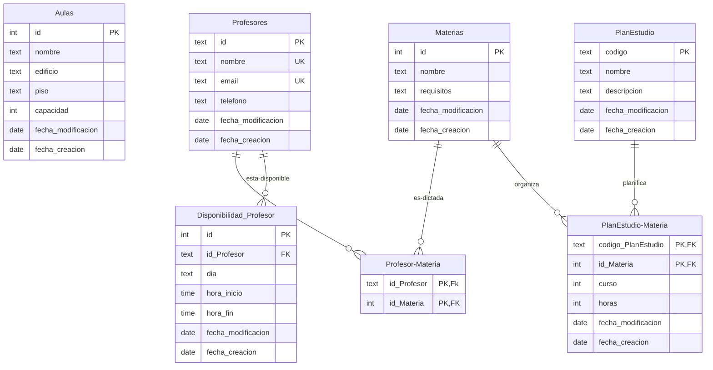

```mermaid
erDiagram
    
    Aulas {
        int id PK
        text nombre
        text edificio
        text piso
        int capacidad
        date fecha_modificacion
        date fecha_creacion
    }

    Profesores {
        text id PK
        text nombre UK
        text email UK
        text telefono
        date fecha_modificacion
        date fecha_creacion
    }

    Materias {
        int id PK
        text nombre
        text requisitos
        date fecha_modificacion
        date fecha_creacion
    }

        Disponibilidad_Profesor {
        int id PK
        text id_Profesor FK
        text dia
        time hora_inicio
        time hora_fin
        date fecha_modificacion
        date fecha_creacion
    }

    Profesor-Materia {
        text id_Profesor PK, Fk
        int id_Materia PK, FK
    }

    PlanEstudio {
        text codigo PK
        text nombre
        text descripcion
        date fecha_modificacion
        date fecha_creacion
    }

    PlanEstudio-Materia {
        text codigo_PlanEstudio PK,FK
        int id_Materia PK, FK
        int curso
        int horas
        date fecha_modificacion
        date fecha_creacion
    }

    Profesores ||--o{ Profesor-Materia: dicta
    Profesores ||--o{ Disponibilidad_Profesor: esta-disponible
    Materias ||--o{ Profesor-Materia: es-dictada
    PlanEstudio ||--o{ PlanEstudio-Materia: planifica
    Materias ||--o{ PlanEstudio-Materia: organiza
```