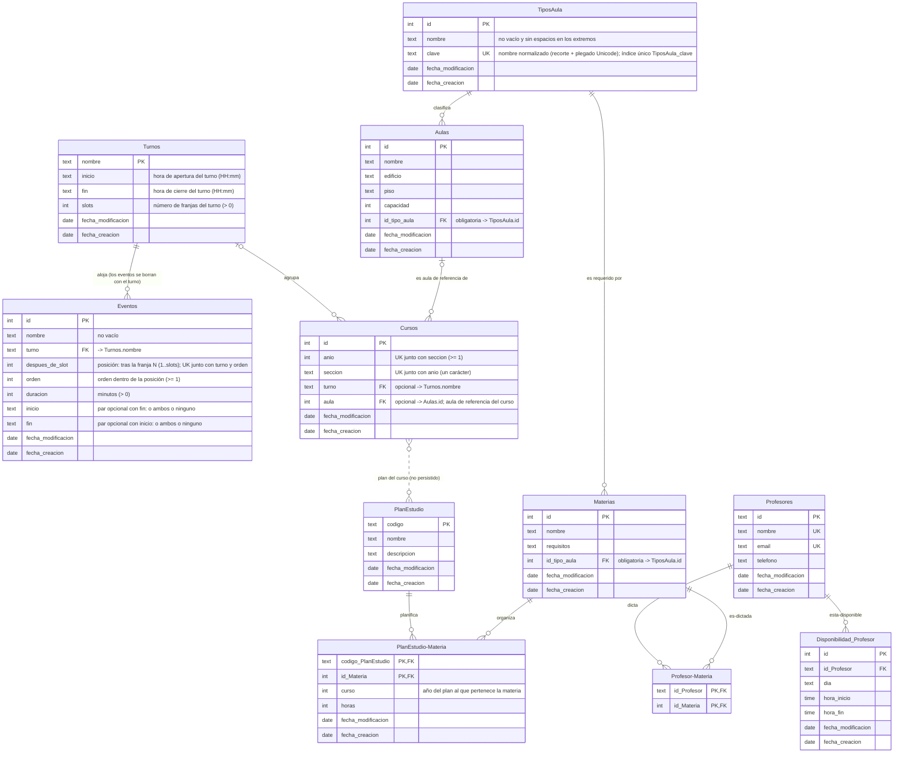

```mermaid
erDiagram
    %% Modelo persistido completo (spec 009 + spec 010).
    %% Los nombres de tabla son los del esquema (SQLite); las columnas marcadas FK
    %% reflejan REFERENCES reales y las UK los índices/claves únicos.

    TiposAula {
        int id PK
        text nombre "no vacío y sin espacios en los extremos"
        text clave UK "nombre normalizado (recorte + plegado Unicode); índice único TiposAula_clave"
        date fecha_modificacion
        date fecha_creacion
    }

    Aulas {
        int id PK
        text nombre
        text edificio
        text piso
        int capacidad
        int id_tipo_aula FK "obligatoria -> TiposAula.id"
        date fecha_modificacion
        date fecha_creacion
    }

    Profesores {
        text id PK
        text nombre UK
        text email UK
        text telefono
        date fecha_modificacion
        date fecha_creacion
    }

    Materias {
        int id PK
        text nombre
        text requisitos
        int id_tipo_aula FK "obligatoria -> TiposAula.id"
        date fecha_modificacion
        date fecha_creacion
    }

    Disponibilidad_Profesor {
        int id PK
        text id_Profesor FK
        text dia
        time hora_inicio
        time hora_fin
        date fecha_modificacion
        date fecha_creacion
    }

    Profesor-Materia {
        text id_Profesor PK, FK
        int id_Materia PK, FK
    }

    PlanEstudio {
        text codigo PK
        text nombre
        text descripcion
        date fecha_modificacion
        date fecha_creacion
    }

    PlanEstudio-Materia {
        text codigo_PlanEstudio PK, FK
        int id_Materia PK, FK
        int curso "año del plan al que pertenece la materia"
        int horas
        date fecha_modificacion
        date fecha_creacion
    }

    Turnos {
        text nombre PK
        text inicio "hora de apertura del turno (HH:mm)"
        text fin "hora de cierre del turno (HH:mm)"
        int slots "número de franjas del turno (> 0)"
        date fecha_modificacion
        date fecha_creacion
    }

    Eventos {
        int id PK
        text nombre "no vacío"
        text turno FK "-> Turnos.nombre"
        int despues_de_slot "posición: tras la franja N (1..slots); UK junto con turno y orden"
        int orden "orden dentro de la posición (>= 1)"
        int duracion "minutos (> 0)"
        text inicio "par opcional con fin: o ambos o ninguno"
        text fin "par opcional con inicio: o ambos o ninguno"
        date fecha_modificacion
        date fecha_creacion
    }

    Cursos {
        int id PK
        int anio "UK junto con seccion (>= 1)"
        text seccion "UK junto con anio (un carácter)"
        text turno FK "opcional -> Turnos.nombre"
        int aula FK "opcional -> Aulas.id; aula de referencia del curso"
        date fecha_modificacion
        date fecha_creacion
    }

    TiposAula ||--o{ Aulas: clasifica
    TiposAula ||--o{ Materias: "es requerido por"
    Profesores ||--o{ Profesor-Materia: dicta
    Profesores ||--o{ Disponibilidad_Profesor: esta-disponible
    Materias ||--o{ Profesor-Materia: es-dictada
    PlanEstudio ||--o{ PlanEstudio-Materia: planifica
    Materias ||--o{ PlanEstudio-Materia: organiza
    Turnos ||--o{ Eventos: "aloja (los eventos se borran con el turno)"
    Turnos |o--o{ Cursos: agrupa
    Aulas |o--o{ Cursos: "es aula de referencia de"
    Cursos }o..o{ PlanEstudio: "plan del curso (no persistido)"
```
