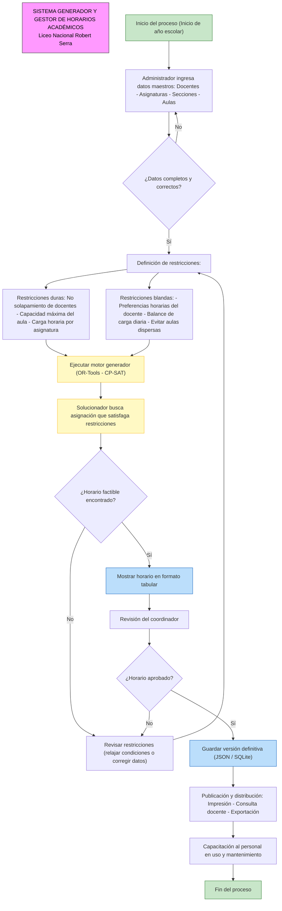

  
  

    
UNIVERSIDAD NACIONAL EXPERIMENTAL DE GUAYANA

    
COORDINACIÓN GENERAL DE PREGRADO

    
COORDINACIÓN DE EDUCACIÓN COMUNITARIA

    
PROYECTO DE CARRERA: Ingenieria en Informática

    
SEDE: Puerto Ordaz

  

  
PROPUESTA DE PRODUCTO MÍNIMO VIABLE

  
PROYECTO GESTOR DE HORARIO

# Responsables.

| **Nombre**        | **Rol**                       |
| ----------------- | ----------------------------- |
| **Daniel Reyna**  | Líder del desarrollo Frontend |
| **Luis Rojas**    | Líder del desarrollo Backend  |
| **Paola Peña**    | Desarrolladora Frontend       |
| **Nicole Sereno** | Desarrolladora Backend        |
| **Manuel Garcia** | Desarrollador Middleware / QA |

# Solución

El motor es un programa que, dadas sus condiciones reales, busca la mejor organización posible de clases, respetando las restricciones rígidas programadas y optimizando las restricciones blandas buscando satisfacer a todos lo mas posible.

## ¿Qué hace este motor?

- **Recibe**:
	- Lista de **docentes** con las materias que dictan y su disponibilidad horaria, preferencias de horas de clase y horas que tienen que ejercer.
	- **Grados** y **secciones** con su carga curricular.
	- **Aulas** con capacidad y tipo.

- **Aplica restricciones rígidas (no negociables)**:
	- Cada asignatura debe completar sus horas semanales.
	- Un docente no puede estar en dos sitios al mismo tiempo.
	- Cumplir con el horario de disponibilidad del docente.
	- Dos secciones no pueden ocupar la misma aula a la misma hora.
	- Cumplimiento de las horas que debe ejercer un docente.

- **Aplica restricciones blandas (negociables)**:
	- Trata de ubicar a cada docente en la franja horaria que prefiera.
	- Evita "ventanas" (horas libres entre clases) para los docentes.

- **Entrega**:
	- Horario en tabla, exportable a PDF.
	- Posibilidad de ajuste manual con re-generación.

# Decisiones Técnicas

| ¿Qué usamos?                        | ¿Por qué?                                                                                                               |
| ----------------------------------- | ----------------------------------------------------------------------------------------------------------------------- |
| Programa de escritorio              | Funciona en cualquier PC del liceo, sin conexión. Los datos no salen de la institución.                                 |
| Lenguaje C++ y biblioteca OR-Tools  | C++ es un lenguaje conocido por su velocidad y eficiencia en el uso de la memoria y los recursos del sistema.           |
| Guardado en archivo (JSON o SQLite) | No requiere instalar servidores de bases de datos ni capacitación avanzada de uso. Hacer respaldo es copiar un archivo. |
| Software completamente gratuito.    | Cero costos de licencias de uso. Pueden instalarlo en varias computadoras.                                              |
| Motor e interfaz separados          | Si más adelante deciden cambiar el diseño del programa, el motor no se toca.                                            |

# Diagrama de flujo.

