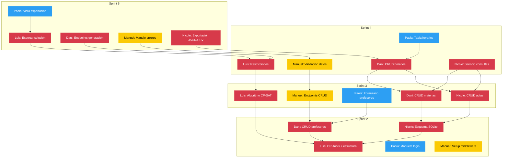
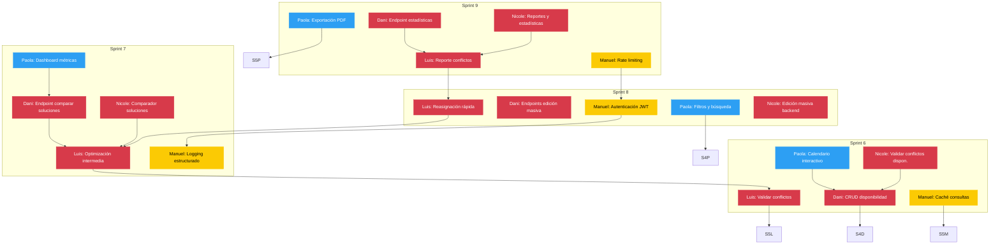

# Diagrama de Dependencias — Gestor Horarios

Diagramas Mermaid de issues por milestone con colores por área y flechas de dependencia.

**Leyenda:**
- 🔴 `area-backend` — Luis, Dani, Nicole
- 🔵 `area-frontend` — Paola
- 🟡 `area-middleware/qa` — Manuel
- 🟣 `area-docs` — Documentación

---

## MVP Base (Sprints 2–5)

---

## Beta (Sprints 6–9)

---

## Release 1.0 (Sprints 10–13)

```mermaid
flowchart TB
    classDef backend fill:#d73a4a,color:#fff,stroke:#d73a4a
    classDef frontend fill:#2d9ff3,color:#fff,stroke:#2d9ff3
    classDef middleware fill:#fbca04,color:#000,stroke:#fbca04
    classDef docs fill:#7057ff,color:#fff,stroke:#7057ff

    subgraph S10["Sprint 10"]
        S10L["Luis: Carga masiva"]:::backend
        S10D["Dani: Validar carga masiva"]:::backend
        S10P["Paola: Interfaz importación"]:::frontend
        S10M["Manuel: Documentación API"]:::docs
        S10N["Nicole: Procesar carga masiva"]:::backend
    end

    subgraph S11["Sprint 11"]
        S11L["Luis: Algoritmo preferencias"]:::backend
        S11D["Dani: Restricciones por aula"]:::backend
        S11P["Paola: Asistente generación"]:::frontend
        S11M["Manuel: Webhooks"]:::middleware
        S11N["Nicole: Preferencias profesores"]:::backend
    end

    subgraph S12["Sprint 12"]
        S12L["Luis: Refactor solver"]:::backend
        S12D["Dani: Historial cambios"]:::backend
        S12P["Paola: Modo oscuro"]:::frontend
        S12M["Manuel: Monitoreo"]:::middleware
        S12N["Nicole: Optimizar SQLite"]:::backend
    end

    subgraph S13["Sprint 13"]
        S13L["Luis: Correcciones finales"]:::backend
        S13D["Dani: Correcciones finales"]:::backend
        S13P["Paola: Correcciones UI"]:::frontend
        S13M["Manuel: Despliegue"]:::middleware
        S13N["Nicole: Tests aceptación"]:::docs
    end

    S10D --> S10L
    S10P --> S10L
    S10N --> S10L

    S11L --> S10L
    S11P --> S11L
    S11N --> S11L

    S12L --> S11L
    S12M --> S11M

    S13L --> S12L & S12D & S12P & S12M & S12N
    S13D --> S12L & S12D & S12P & S12M & S12N
    S13P --> S12P
    S13M --> S12M
    S13N --> S12L & S12D & S12P & S12M & S12N
```

