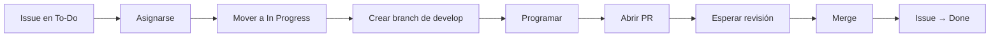

# Guía de Trabajo — Gestor Horarios

---

## 📍 Organización

```
Nombre: Servicio-Comunitario-Gestor-Horarios
URL:    https://github.com/Servicio-Comunitario-Gestor-Horarios
```

### Teams

| Team | Rol en el repo | Miembros |
|------|---------------|----------|
| **Tech-Leads** | Admin | Líderes del proyecto |
| **QA** | Write | Persona de calidad |
| **Devs** | Write | Desarrolladores |

---

## 📦 Repositorio

```
Nombre:   Dev_Servicio-Comunitario_Gestor-Horarios
URL:      https://github.com/Servicio-Comunitario-Gestor-Horarios/Dev_Servicio-Comunitario_Gestor-Horarios
Default:  main
```

---

## 🏗️ Estructura de branches

```
main
  └── develop        ← Base para desarrollo
       ├── feature/*  ← Nuevas funcionalidades
       ├── fix/*      ← Corrección de bugs
       └── ...        ← Cualquier nombre descriptivo
```

**Reglas:**
- Solo Tech-Leads pueden pushear directo a `main` y `develop`
- Los devs crean branches desde `develop`
- Los devs **nunca** pushean directo a `main` o `develop`
- Los PRs se mergean siempre con **Squash**

---

## 🛡️ Rulesets configurados

### `main-protection` — Rama `main`

| Regla | Estado |
|-------|--------|
| Restrict updates | ✅ Solo Tech-Leads bypass |
| Restrict deletions | ✅ |
| Require pull request before merging | ✅ |
| └─ Required approvals | **2** |
| └─ Require review from Code Owners | ✅ |
| └─ Allowed merge methods | Solo **Squash** |
| Require linear history | ✅ |
| Block force pushes | ✅ |
| Required reviewers | Tech-Leads (2 approvals) |

### `develop-protection` — Rama `develop`

| Regla | Estado |
|-------|--------|
| Restrict updates | ✅ Solo Tech-Leads bypass |
| Restrict deletions | ✅ |
| Require pull request before merging | ✅ |
| └─ Required approvals | **2** |
| └─ Require review from Code Owners | ✅ |
| └─ Allowed merge methods | Solo **Squash** |
| Require linear history | ✅ |
| Block force pushes | ✅ |
| Required reviewers | Tech-Leads (2 approvals) |

---

## 👑 CODEOWNERS

Archivo: `.github/CODEOWNERS`

```codeowners
* @Servicio-Comunitario-Gestor-Horarios/Tech-Leads

Todo cambio necesita aprobación de ambos Tech-Leads como code owners.

---

## 🏷️ Labels con colores

| Label | Color Hex | Descripción |
|-------|-----------|-------------|
| `bug` | `#d73a4a` | Algo que no funciona correctamente |
| `enhancement` | `#a2eeef` | Nueva funcionalidad o mejora |
| `tech-debt` | `#7057ff` | Deuda técnica por refactorizar |
| `urgent` | `#e99695` | Prioritario, atención inmediata |
| `question` | `#fef2c0` | Discusión necesaria, duda |
| `good-first-issue` | `#0e8a16` | Para personas nuevas en el proyecto |
| `wontfix` | `#ffffff` | No se va a implementar |

### Cómo crear/editar labels

```
Repo → Issues → Labels → New label
```

Completar nombre, color (hex), descripción opcional.

---

## 📋 Project Board

```
URL: https://github.com/orgs/Servicio-Comunitario-Gestor-Horarios/projects/1
Nombre: Gestor-Horarios Sprint Board
Tipo: Kanban
```

### Columnas

| Columna | Significado |
|---------|-------------|
| **Backlog** | Ideas sin priorizar |
| **To-Do** | Issues listas para trabajar |
| **In Progress** | Alguien está trabajando en esto |
| **In Review** | PR abierto esperando aprobación |
| **Done** | Completado |

### Vistas disponibles

- **Board** — Vista kanban por columnas
- **Por Asignado** — Tabla agrupada por persona

---

## 🤖 Workflows automáticos del Project Board

Estos workflows ya están configurados en el proyecto:

| Workflow | Trigger | Acción |
|----------|---------|--------|
| Auto-add to project | Issue/PR creada | Agrega al proyecto automáticamente |
| Item added to project | Issue agregada | Status → **To-Do** |
| Pull request linked to issue | PR con `Closes #N` | Status → **In Review** |
| Pull request merged | PR mergeado | Status → **Done** |
| Item closed | Issue cerrada manual | Status → **Done** |

---

## 🔄 Flujo de trabajo completo

### Para un desarrollador



### Paso a paso detallado

**1. Agarrar una issue**

```bash
# Buscar issues en To-Do en el Project Board
# Asignarse a la issue (solo click en Assignees)
# Mover a In Progress (arrastrar en el board)
```

**2. Crear branch y programar**

```bash
git checkout develop
git pull origin develop
git checkout -b feature/mi-cambio
# ... programar, commitear ...
git push origin feature/mi-cambio
```

**3. Abrir Pull Request**

```bash
# Desde GitHub:
#   New Pull Request
#   Base: develop ← Comparar: feature/mi-cambio
#
# Descripción:
#   ## Resumen
#   Breve descripción del cambio
#
#   Closes #NUMERO_DE_ISSUE
```

**4. Esperar revisión**

- El PR asigna automáticamente a **Tech-Leads** como reviewers
- Se requieren **2 approvals** (ambos Tech-Leads)
- Si ambos Tech-Leads aprueban → se puede mergear

**5. Mergear**

```bash
# Solo Tech-Leads hacen click en "Squash and merge"
# La issue se cierra y pasa a Done automáticamente
```

---

## 🐙 Commits con referencia a issues

Para vincular commits automáticamente a una issue, incluir en el mensaje:

```bash
git commit -m "fix: corrige cálculo de horas

Closes #15"
```

Keywords válidas: `Closes`, `Fixes`, `Resolves`, `Close`, `Fix`

También funciona en la descripción del PR:

```markdown
## Cambios realizados
- Corrige bug en login
- Agrega tests

Closes #15
```

---

## 🔐 Secretos del repositorio

| Nombre | Propósito |
|--------|-----------|
| `GH_PROJECT_TOKEN` | Token para GitHub Actions (auto-add a project) |

### Crear el token

```
https://github.com/settings/tokens → Generate new token → Fine-grained token
  Nombre: PROJECT_TOKEN
  Repos: Dev_Servicio-Comunitario_Gestor-Horarios
  Permisos:
    - Issues: Read & Write
    - Pull Requests: Read & Write
    - (Organization) Projects: Read & Write
```

Guardar en:

```
Repo → Settings → Secrets and variables → Actions → New repository secret
  Name: GH_PROJECT_TOKEN
  Value: <token>
```

---

## ✅ Checklist para nuevos integrantes

- [ ] Recibir invitación a la organización
- [ ] Aceptar invitación (llega al email asociado a GitHub)
- [ ] Clonar el repo: `git clone git@github.com:Servicio-Comunitario-Gestor-Horarios/Dev_Servicio-Comunitario_Gestor-Horarios.git`
- [ ] Leer esta guía
- [ ] Revisar las issues en el Project Board
- [ ] Agarrar una `good-first-issue` si es la primera vez

---

## 📚 Referencias

- **Tablero**: https://github.com/orgs/Servicio-Comunitario-Gestor-Horarios/projects/1
- **Issues**: https://github.com/Servicio-Comunitario-Gestor-Horarios/Dev_Servicio-Comunitario_Gestor-Horarios/issues
- **PRs**: https://github.com/Servicio-Comunitario-Gestor-Horarios/Dev_Servicio-Comunitario_Gestor-Horarios/pulls
- **CODEOWNERS**: `.github/CODEOWNERS`
- **Actions**: `.github/workflows/auto-move-project.yml`
