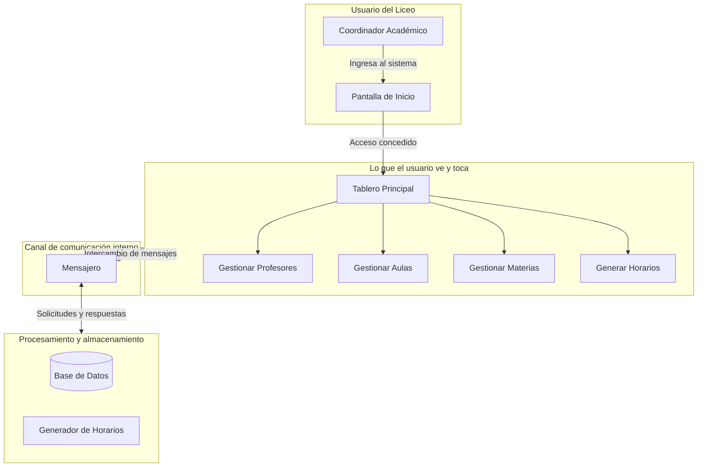
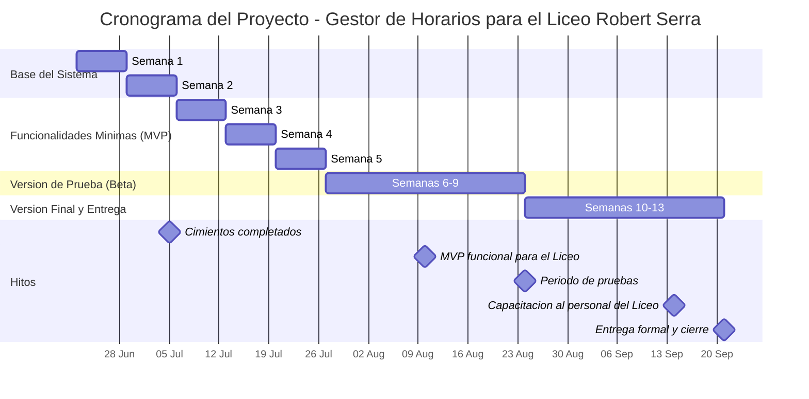

# INFORME DE AVANCE SEMANAL
## Proyecto Gestor de Horario — Servicio Comunitario UNEG
### Semana del 29 de junio al 5 de julio de 2026 — Sprint 2

---

| Dato | Información |
|------|-------------|
| **Institución beneficiaria** | Liceo Nacional Robert Serra |
| **Casa de estudio** | Universidad Nacional Experimental de Guayana (UNEG) — Coordinación de Educación Comunitaria |
| **Carrera** | Ingeniería en Informática |
| **Equipo de trabajo** | Teach-Leads: Luis Rojas, Daniel Reyna · Devs: Nicole Sereno, Paola Peña · Middleware/QA: Manuel García |
| **Rol del proyecto** | Sistema Generador y Gestor de Horarios Académicos |

> **Nota — Roles del equipo:** Cada rol tiene una función específica en el desarrollo del sistema:
> - **Teach-Lead**: estudiante que coordina y guía el trabajo técnico de su área.
> - **Backend / Motor**: la parte del programa que procesa datos y realiza los cálculos.
> - **Frontend / Interfaz**: la parte visual que el usuario ve y con la que interactúa.
> - **Middleware / Mensajero**: el canal de comunicación que conecta el motor con la interfaz.
> - **QA (Quality Assurance)**: quien verifica que todo funcione correctamente antes de entregarlo.

---

## 1. Resumen Ejecutivo

Durante esta segunda semana de trabajo, el equipo completó los **cimientos tecnológicos** del sistema[cite: 1]. Se trata de un hito de infraestructura que permite unificar las pantallas visuales y el motor matemático en un **único archivo ejecutable**. Esto garantiza que el programa pueda usarse en computadoras básicas de forma directa y estable.

### ¿Qué problema concreto se resolvió?

**Antes de esta semana**, para poder trabajar en el proyecto era necesario instalar una gran cantidad de herramientas y componentes matemáticos muy pesados (más de 2GB), lo que dificultaba que todo el equipo pudiera avanzar con facilidad[cite: 1].

**Ahora**, organizamos el proyecto en una especie de "caja de herramientas virtual" que aísla los componentes matemáticos pesados. Esto permite que los encargados de diseñar las pantallas puedan trabajar de forma rápida y directa en sus computadoras sin ralentizarlas. Además, logramos un avance clave: unificamos todo el sistema interno para que al final se genere **un solo programa instalable**, evitando que el usuario del Liceo tenga que abrir varios archivos a la vez para que el gestor funcione.

### ¿Por qué esto es importante para el Liceo Robert Serra?

1. **Facilidad de uso**: Al entregar el sistema condensado en un solo archivo, el personal del Liceo no tendrá que lidiar con configuraciones complicadas. Será tan sencillo como abrir cualquier programa común en la computadora del plantel.
2. **Entrega completa y mantenimiento futuro**: Al finalizar nuestra labor de servicio comunitario, entregaremos el programa listo para usar, pero también el código fuente original y su entorno de desarrollo ya configurado. Esto significa que si en el futuro el Liceo desea que otro programador haga una mejora o actualización, esa persona no tendrá que armar el entorno desde cero; ya tendrá la estructura lista para empezar a trabajar de inmediato.

---

## 2. Estado de Salud del Proyecto

### Semáforo: 🟢 VERDE — Cimientos completados

| Dimensión | Estado | Detalle |
|-----------|:------:|---------|
| **Cimientos técnicos** | 🟢 | Base de datos operativa, comunicación entre componentes estable, interfaz visual básica funcional |
| **Avance del Sprint 2** | 🟢 | 5 de 6 tareas completadas (83%) |
| **Participación del equipo** | 🟢 | Los 5 estudiantes realizaron contribuciones esta semana |
| **Compromisos con el Liceo** | 🟢 | Sin retrasos críticos. El cronograma proyecta la versión funcional para agosto de 2026 |
| **Pruebas automáticas** | 🟡 | 8 pruebas funcionando. |

### Avance del Proyecto General

Del total de 73 tareas planificadas para todo el proyecto, distribuidas en 12 semanas de trabajo:

```
Fase de Cimientos (Sprints 1 y 2)    ████████████████████   100% ✅
Fase MVP (Sprints 3 al 5)            ░░░░░░░░░░░░░░░░░░░░     0%
Fase Beta (Sprints 6 al 9)           ░░░░░░░░░░░░░░░░░░░░     0%
Fase Entrega (Sprints 10 al 13)      ░░░░░░░░░░░░░░░░░░░░     0%
```

**5 de 73 tareas completadas (~7% del proyecto total, 100% de la fase de cimientos).**

### Avance del Sprint 2 (29 junio - 5 julio)

| Ref. | Tarea | Área | Responsable | Estado |
|:----:|-------|------|:-----------:|:------:|
| S2-I1 | Motor de optimización + Estructuras de datos | Backend | Luis | ✅ Completado |
| S2-I3 | Maqueta de login y dashboard | Frontend | Paola | ✅ Completado |
| S2-I4 | Setup de mensajero + health-check | Middleware | Manuel | ✅ Completado |
| S2-I5 | Esquema SQLite profesores + aulas | Backend | Nicole | ✅ Completado |
| S2-I6 | Scaffold Qt + capacitación Qt Creator | Frontend | Dani | ✅ Completado |
| S2-I2 | Endpoints para gestión de datos de profesores vía mensajero | Middleware | Manuel | 🔲 Pendiente (pasa a Sprint 3) |

**Progreso del Sprint 2: 80% (5 de 6 tareas completadas)**

---

## 3. Aportes por Estudiante

A continuación se traduce el trabajo técnico de cada estudiante en beneficios concretos para el Liceo Nacional Robert Serra.

### Luis Rojas — Teach-Lead / Backend
*4 contribuciones esta semana*

| Trabajo realizado | ¿Qué significa para el Liceo? |
|-------------------|-------------------------------|
| Rediseñó la forma en que el programa se construye, haciéndolo modular, y documentó la arquitectura del sistema con diagramas y guías | El sistema se adapta a cualquier computadora del Liceo y queda documentado para futuros equipos |
| Automatizó el tablero de control del proyecto | El progreso de cada tarea se actualiza automáticamente — se puede ver el avance de las tareas en tiempo real |

### Daniel Reyna — Teach-Lead / Frontend
*1 contribución esta semana*

| Trabajo realizado | ¿Qué significa para el Liceo? |
|-------------------|-------------------------------|
| Configuró el entorno de trabajo para el diseño visual de las pantallas | Preparó las herramientas digitales para que el equipo de interfaz pueda construir las pantallas de forma eficiente |
| Configuró el sistema de compilación para que la interfaz pueda desarrollarse de forma independiente | Permite que los diseñadores visuales trabajen sin depender del motor principal, acelerando el desarrollo |

### Nicole Sereno — Developer / Backend
*2 contribuciones esta semana*

| Trabajo realizado | ¿Qué significa para el Liceo? |
|-------------------|-------------------------------|
| Implementó la base de datos para almacenar información de profesores y aulas | El sistema ahora puede guardar los datos de los docentes y las aulas del Liceo, y recuperarlos cuando sea necesario |
| Creó pruebas automáticas de guardado y recuperación | La información del Liceo estará protegida: el sistema verifica automáticamente que los datos se guarden y recuperen correctamente |
| Implementó validaciones de integridad en la base de datos | Esto permite que la información del Liceo esté protegida y siempre disponible |

### Paola Peña — Developer / Frontend
*1 contribución esta semana*

| Trabajo realizado | ¿Qué significa para el Liceo? |
|-------------------|-------------------------------|
| Creó la pantalla de inicio y el tablero principal del sistema | Los usuarios del Liceo ya pueden ver la puerta de entrada al sistema y el escritorio de trabajo principal donde gestionarán los horarios |
| Diseñó prototipos de las pantallas del sistema como referencia visual | Estos prototipos sirven como guía visual para los desarrolladores, asegurando que el sistema final sea fácil de usar para el personal del Liceo |

### Manuel García — Middleware / QA
*4 contribuciones esta semana*

| Trabajo realizado | ¿Qué significa para el Liceo? |
|-------------------|-------------------------------|
| Implementó el canal de comunicación entre la interfaz visual y el motor de procesamiento | Las pantallas que vea el usuario podrán enviar información al motor y recibir respuestas, como un mensajero interno |
| Configuró un sistema de verificación de salud del programa | El sistema podrá detectar automáticamente si alguna de sus partes falla y reportarlo |
| Configuró alertas para el monitoreo continuo del sistema | El sistema de salud permite detectar automáticamente si algún componente falla y reportarlo |

---

## 4. ¿Cómo funciona el sistema hoy?

A continuación se presenta un diagrama que muestra cómo se relacionan las partes del sistema hasta ahora construidas:



**Lo que ya funciona:** Las tres capas están construidas y conectadas. Esto significa que el sistema tiene el "esqueleto" completo.

**Lo que sigue:** Durante la próxima semana se construirán los formularios para capturar la información de profesores, aulas y materias del Liceo.

---

## 5. Mapa de Ruta — ¿Dónde estamos y hacia dónde vamos?



**📍 Estamos aquí:** Sprint 2 completado. El Sprint 3 arranca el lunes 6 de julio.

**Próximo hito importante:** Para el 10 de agosto, el sistema debe tener la funcionalidad mínima para ser evaluado por el Liceo (MVP). Quedan 5 semanas para llegar a esa meta.

---

## 6. Observaciones 

### Situación actual

1. **El Sprint 2 se completó al 80%.** De las 6 tareas planificadas, 5 están terminadas y probadas. La sexta (gestión de datos de profesores) se trasladó al Sprint 3 sin afectar el cronograma general.

2. **Los cimientos del sistema están sólidos.** Base de datos, comunicación entre componentes, pantalla de inicio y tablero principal — todo operativo y documentado.

3. **Los 5 estudiantes contribuyeron activamente en sus áreas.** Los Teach-Leads (Luis y Daniel) asumieron la mayor carga técnica de infraestructura para liberar al equipo y que todos pudieran contribuir desde sus fortalezas.

### Lo que viene — Sprint 3 (6 al 12 de julio)

| Estudiante | Tarea asignada | Producto esperado |
|------------|----------------|-------------------|
| Luis (Teach-Lead/Backend) | Modelo de datos completo + diagrama ER | Documento visual de cómo se organiza la información en el sistema |
| Daniel (Teach-Lead/Frontend) | Prototipos del tablero y navegación | Maquetas de todas las pantallas del sistema y su flujo de uso |
| Nicole (Dev/Backend) | Gestión de datos de materias + Gestión de datos de aulas | Funcionalidad para gestionar materias y espacios físicos en el Liceo |
| Paola (Dev/Frontend) | Formulario de registro de profesores | Pantalla donde el Liceo capturará los datos de sus docentes |
| Manuel (Middleware/QA) | Enrutamiento para gestión de datos interfaz → motor | Los formularios enviarán datos al motor de procesamiento |

Para cualquier consulta o ampliación de este informe, los coordinadores del proyecto están a disposición de la Coordinación de Educación Comunitaria de la UNEG.

---

*Documento generado el 5 de julio de 2026*
*Proyecto Gestor de Horario — Servicio Comunitario*
*Universidad Nacional Experimental de Guayana*
*Liceo Nacional Robert Serra*
