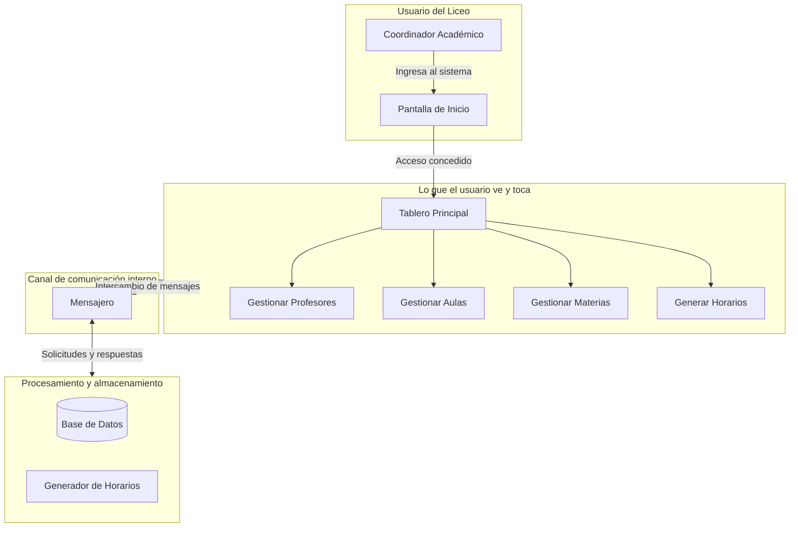
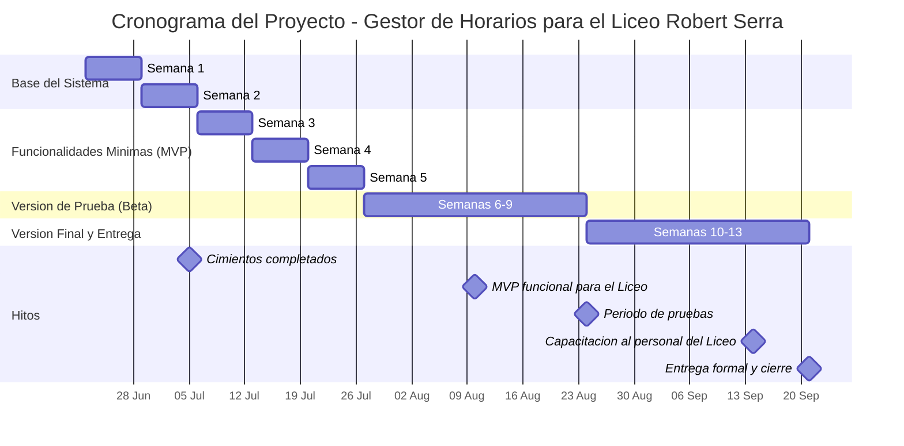

# INFORME DE AVANCE SEMANAL
## Proyecto Gestor de Horario — Servicio Comunitario UNEG
### Semana del 6 al 12 de julio de 2026 — Sprint 3

---

| Dato | Información |
|------|-------------|
| **Institución beneficiaria** | Liceo Nacional Robert Serra |
| **Casa de estudio** | Universidad Nacional Experimental de Guayana (UNEG) — Coordinación de Educación Comunitaria |
| **Carrera** | Ingeniería en Informática |
| **Equipo de trabajo** | Teach-Leads: Luis Rojas, Daniel Reyna · Devs: Nicole Sereno, Paola Peña · Middleware/QA: Manuel García |
| **Rol del proyecto** | Sistema Generador y Gestor de Horarios Académicos |

> **Nota — Roles del equipo:** Cada rol tiene una función específica en el desarrollo del sistema:
> - **Teach-Lead**: estudiante que coordina y guía el trabajo técnico de su área.
> - **Backend / Motor**: la parte del programa que procesa datos y realiza los cálculos.
> - **Frontend / Interfaz**: la parte visual que el usuario ve y con la que interactúa.
> - **Middleware / Mensajero**: el canal de comunicación que conecta el motor con la interfaz.
> - **QA (Quality Assurance)**: quien verifica que todo funcione correctamente antes de entregarlo.

---

## 1. Resumen Ejecutivo

Durante esta tercera semana de trabajo, el equipo construyó las **funcionalidades visuales y de datos** del sistema. Se trata de un hito de productividad que transforma el "esqueleto técnico" del Sprint 2 en un sistema con pantallas interactivas, formularios de captura y servicios de almacenamiento para las tres entidades principales: profesores, materias y aulas.

### ¿Qué problema concreto se resolvió?

**Antes de esta semana**, el sistema tenía una base de datos y un canal de comunicación, pero el usuario no podía interactuar con ninguna pantalla. No había formularios para ingresar datos, ni un tablero que mostrara el estado del sistema.

**Ahora**, el sistema cuenta con:
1. **Pantalla de inicio y tablero principal** con navegación por secciones (sidebar).
2. **Formulario de registro de profesores** con validación de campos y conexión al backend.
3. **Dos servicios CRUD completos** para gestionar materias y aulas del Liceo.
4. **Enrutamiento de mensajes** que permite que la interfaz envíe peticiones al motor de procesamiento.

### ¿Por qué esto es importante para el Liceo Robert Serra?

1. **Captura de datos real**: El personal del Liceo ahora puede ingresar la información de sus profesores, materias y aulas a través de pantallas diseñadas para facilitar ese proceso.
2. **Almacenamiento seguro**: Los datos se guardan en una base de datos SQLite con validaciones de integridad, previniendo información duplicada o incompleta.
3. **Navegación intuitiva**: El tablero principal organiza las funciones del sistema en secciones claras, reduciendo la curva de aprendizaje para el personal del Liceo.

---

## 2. Estado de Salud del Proyecto

### Semáforo: 🟢 VERDE — Funcionalidades visuales completadas

| Dimensión | Estado | Detalle |
|-----------|:------:|---------|
| **Cimientos técnicos** | 🟢 | Base de datos, comunicación e interfaz operativas (Sprint 2) |
| **Avance del Sprint 3** | 🟢 | 5 de 6 tareas completadas (83%) |
| **Participación del equipo** | 🟢 | Los 5 estudiantes realizaron contribuciones esta semana |
| **Compromisos con el Liceo** | 🟢 | Sin retrasos críticos. El cronograma proyecta la versión funcional para agosto de 2026 |
| **Pruebas automáticas** | 🟡 | 13 archivos de test backend disponibles |

### Avance del Proyecto General

Del total de 73 tareas planificadas para todo el proyecto, distribuidas en 12 semanas de trabajo:

```
Fase de Cimientos (Sprints 1 y 2)    ████████████████████   100% ✅
Fase MVP (Sprints 3 al 5)            ████████░░░░░░░░░░░░    33%
Fase Beta (Sprints 6 al 9)           ░░░░░░░░░░░░░░░░░░░░     0%
Fase Entrega (Sprints 10 al 13)      ░░░░░░░░░░░░░░░░░░░░     0%
```

**10 de 73 tareas completadas (~14% del proyecto total, 100% de la fase de cimientos + 33% de la fase MVP).**

### Avance del Sprint 3 (6 jul - 12 jul)

| Ref. | Tarea | Área | Responsable | Estado |
|:----:|-------|------|:-----------:|:------:|
| S3-I1 | Modelo de datos entidades + diagrama ER | Backend | Luis | ✅ Completado |
| S3-I2 | CRUD de materias | Backend | Nicole | ✅ Completado |
| S3-I3 | Formulario de registro de profesores y MainWindow | Frontend | Paola | ✅ Completado |
| S3-I4 | Enrutamiento CRUD frontend → backend | Middleware | Manuel | 🔲 Pendiente (pasa a Sprint 4) |
| S3-I5 | CRUD de aulas | Backend | Nicole | ✅ Completado |
| S3-I6 | Prototipos dashboard + flujo de navegación | Frontend | Dani | ✅ Completado |

**Progreso del Sprint 3: 83% (5 de 6 tareas completadas)**

---

## 3. Aportes por Estudiante

A continuación se traduce el trabajo técnico de cada estudiante en beneficios concretos para el Liceo Nacional Robert Serra.

### Luis Rojas — Teach-Lead / Backend
*3 contribuciones esta semana*

| Trabajo realizado | ¿Qué significa para el Liceo? |
|-------------------|-------------------------------|
| Creó el diagrama entidad-relación del sistema y documentó la estructura de datos | El Liceo puede ver visualmente cómo se organiza toda su información (profesores, materias, aulas) en el sistema |
| Implementó los stubs de enrutamiento CRUD para profesores | Los formularios de la interfaz ahora pueden enviar datos al motor de procesamiento |
| Corrigió el PR #62 de Nicole — build, convenciones y tests | Aseguró que el código de backend cumpla estándares de calidad y compile correctamente |

### Daniel Reyna — Teach-Lead / Frontend
*1 contribución esta semana*

| Trabajo realizado | ¿Qué significa para el Liceo? |
|-------------------|-------------------------------|
| Implementó el dashboard principal y el sistema de navegación por secciones | Los usuarios del Liceo ahora tienen un tablero de control organizado con acceso directo a cada función del sistema |

### Nicole Sereno — Developer / Backend
*2 contribuciones esta semana*

| Trabajo realizado | ¿Qué significa para el Liceo? |
|-------------------|-------------------------------|
| Implementó el CRUD completo de materias con validaciones | El Liceo puede registrar, consultar, editar y eliminar materias con protección contra datos inválidos |
| Implementó el CRUD completo de aulas con manejo de restricciones UNIQUE | El Liceo puede gestionar sus espacios físicos sin riesgo de duplicar nombres de aulas |

### Paola Peña — Developer / Frontend
*1 contribución esta semana*

| Trabajo realizado | ¿Qué significa para el Liceo? |
|-------------------|-------------------------------|
| Creó el formulario de registro de profesores con validación de campos | El Liceo ahora tiene una pantalla donde capturar datos de docentes con validación automática (email, nombre, teléfono) |

### Manuel García — Middleware / QA
*0 contribuciones esta semana*

| Trabajo realizado | ¿Qué significa para el Liceo? |
|-------------------|-------------------------------|
| — | La tarea de enrutamiento CRUD fue asumida temporalmente por Luis para desbloquear al equipo |

---

## 4. ¿Cómo funciona el sistema hoy?

A continuación se presenta un diagrama que muestra cómo se relacionan las partes del sistema hasta ahora construidas:



**Lo que ya funciona:**
- Las tres capas están construidas y conectadas.
- El usuario puede navegar entre secciones del tablero.
- El formulario de profesores envía datos al backend.
- Los servicios CRUD de materias y aulas almacenan y recuperan datos.
- La base de datos valida la integridad de la información.

**Lo que sigue:** Durante la próxima semana se completará el enrutamiento CRUD, se implementará la generación automática de horarios con el solver CP-SAT, y se conectarán los formularios de materias y aulas a la interfaz.

---

## 5. Mapa de Ruta — ¿Dónde estamos y hacia dónde vamos?



**📍 Estamos aquí:** Sprint 3 completado. El Sprint 4 arranca el lunes 13 de julio.

**Próximo hito importante:** Para el 10 de agosto, el sistema debe tener la funcionalidad mínima para ser evaluado por el Liceo (MVP). Quedan 4 semanas para llegar a esa meta.

---

## 6. Observaciones

### Situación actual

1. **El Sprint 3 se completó al 83%.** De las 6 tareas planificadas, 5 están terminadas y probadas. La sexta (enrutamiento CRUD) se trasladó al Sprint 4 sin afectar el cronograma general.

2. **Los formularios y servicios CRUD están operativos.** El sistema ahora tiene pantallas de captura para profesores, y servicios backend para gestionar materias y aulas.

3. **Los 4 estudiantes contribuyeron activamente en sus áreas.** Luis asumió la tarea de enrutamiento para desbloquear al equipo, mientras Nicole completó ambos servicios CRUD de backend.

### Lo que viene — Sprint 4 (13 al 19 de julio)

| Estudiante | Tarea asignada | Producto esperado |
|------------|----------------|-------------------|
| Luis (Teach-Lead/Backend) | Modelo CP-SAT + restricciones de optimización | Motor de generación automática de horarios |
| Daniel (Teach-Lead/Frontend) | Formularios de secciones y conexión IPC | Pantallas para gestionar secciones del Liceo |
| Nicole (Dev/Backend) | CRUD horarios + consultas de horarios | Funcionalidad para crear y consultar horarios generados |
| Paola (Dev/Frontend) | Formularios de entrada docente y sección | Formularios completos para las entidades del sistema |
| Manuel (Middleware/QA) | Tests unitarios del modelo de datos | Verificación automática de integridad de datos |

Para cualquier consulta o ampliación de este informe, los coordinadores del proyecto están a disposición de la Coordinación de Educación Comunitaria de la UNEG.

---

*Documento generado el 12 de julio de 2026*
*Proyecto Gestor de Horario — Servicio Comunitario*
*Universidad Nacional Experimental de Guayana*
*Liceo Nacional Robert Serra*
