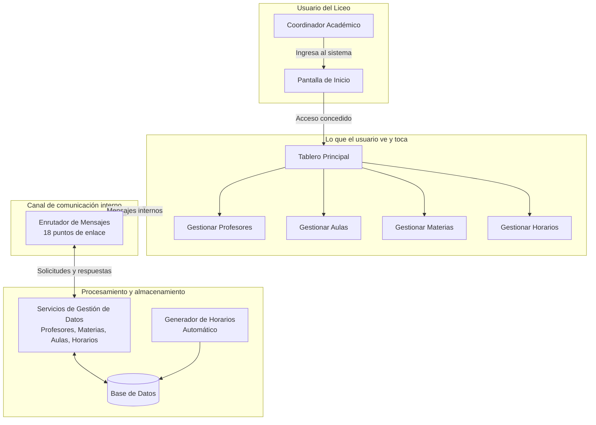
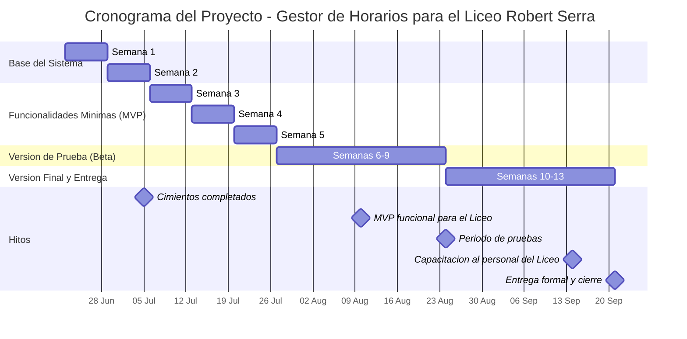

# INFORME DE AVANCE SEMANAL
## Proyecto Gestor de Horario — Servicio Comunitario UNEG
### Semana del 13 al 19 de julio de 2026 — Semana 4

---

| Dato | Información |
|------|-------------|
| **Institución beneficiaria** | Liceo Nacional Robert Serra |
| **Casa de estudio** | Universidad Nacional Experimental de Guayana (UNEG) — Coordinación de Educación Comunitaria |
| **Carrera** | Ingeniería en Informática |
| **Equipo de trabajo** | Teach-Leads: Luis Rojas, Daniel Reyna · Devs: Nicole Sereno, Paola Peña · Middleware/QA: Manuel García |
| **Rol del proyecto** | Sistema Generador y Gestor de Horarios Académicos |

> **Nota — Roles del equipo:** Cada rol tiene una función específica en el desarrollo del sistema:
> - **Teach-Lead**: estudiante que coordina y guía el trabajo técnico de su área.
> - **Backend / Motor**: la parte del programa que procesa datos y realiza los cálculos.
> - **Frontend / Interfaz**: la parte visual que el usuario ve y con la que interactúa.
> - **Middleware / Mensajero**: el canal de comunicación que conecta el motor con la interfaz.
> - **QA (Quality Assurance)**: quien verifica que todo funcione correctamente antes de entregarlo.

---

## 1. Resumen Ejecutivo

Durante esta cuarta semana de trabajo, el equipo avanzó en las **funcionalidades principales del sistema**: gestión de horarios, módulo de aulas, formulario de asignaturas y la comunicación completa entre las partes del sistema. Se trata de una semana de alta productividad donde se sentaron las bases para la generación automática de horarios.

### ¿Qué problema concreto se resolvió?

**Antes de esta semana**, el sistema tenía formularios de profesores y podía guardar materias y aulas, pero no existía forma de gestionar horarios ni de conectar todos los formularios con el motor de procesamiento.

**Ahora**, el sistema cuenta con:
1. **Gestión completa de horarios**: crear, editar, consultar y eliminar horarios, con protección contra errores como asignar el mismo profesor o aula en el mismo turno.
2. **Consultas de horarios**: el sistema puede mostrar información completa de horarios (profesor, aula, materia) de forma rápida y organizada.
3. **Módulo completo de aulas**: una pantalla donde el Liceo puede registrar y consultar sus espacios físicos.
4. **Formulario de asignaturas**: una pantalla para registrar materias con protección contra datos incompletos.
5. **Comunicación completa**: todas las pantallas del sistema ahora pueden enviar y recibir datos de forma confiable y ordenada.

### ¿Por qué esto es importante para el Liceo Robert Serra?

1. **Gestión de horarios**: El Liceo ahora puede crear, editar y consultar horarios de forma manual, como alternativa a la generación automática. Esto permite gestionar asignaciones de profesores a aulas y materias por día y hora.
2. **Comunicación completa**: todas las pantallas del sistema pueden enviar y recibir datos de forma confiable. Cada formulario funciona como una pieza conectada con el resto.
3. **Datos listos para mostrar**: las consultas de horarios devuelven información completa (nombre del profesor, nombre del aula, nombre de la materia) lista para mostrar en pantallas del Liceo.

---

## 2. Estado de Salud del Proyecto

### Semáforo: 🟡 AMARILLO — Funcionalidades en revisión

| Dimensión | Estado | Detalle |
|-----------|:------:|---------|
| **Cimientos técnicos** | 🟢 | Base de datos, comunicación e interfaz operativas (Semana 2) |
| **Avance de la Semana 4** | 🟡 | 4 de 6 tareas con entrega enviada (67%), 2 en progreso |
| **Participación del equipo** | 🟢 | Los 5 estudiantes realizaron contribuciones esta semana |
| **Compromisos con el Liceo** | 🟢 | Sin retrasos críticos. El cronograma proyecta la versión funcional para agosto de 2026 |
| **Pruebas automáticas** | 🟢 | 13 archivos de verificación + pruebas de situaciones especiales en progreso |

### Avance del Proyecto General

Del total de 73 tareas planificadas para todo el proyecto, distribuidas en 12 semanas de trabajo:

```
Fase de Cimientos (Semanas 1 y 2)     ████████████████████   100% ✅
Fase MVP (Semanas 3 al 5)             ████████████████░░░░    67%
Fase Beta (Semanas 6 al 9)            ░░░░░░░░░░░░░░░░░░░░     0%
Fase Entrega (Semanas 10 al 13)       ░░░░░░░░░░░░░░░░░░░░     0%
```

**16 de 73 tareas completadas (~22% del proyecto total, 100% de la fase de cimientos + 67% de la fase MVP).**

### Avance de la Semana 4 (13 jul - 19 jul)

| Ref. | Tarea | Área | Responsable | Estado |
|:----:|-------|------|:-----------:|:------:|
| S4-I1 | Modelo de generación automática de horarios | Backend | Luis | 🔄 En progreso (sin entrega) |
| S4-I2 | Gestión de horarios (asignación manual) | Backend | Nicole | ✅ Entrega #67 enviada |
| S4-I3 | Consultas de horarios | Backend | Nicole | ✅ Entrega #67 enviada |
| S4-I4 | Verificaciones del modelo de datos | Middleware/QA | Manuel | 🔄 En progreso (sin entrega) |
| S4-I5 | Módulo de aulas + conexión al sistema | Frontend | Paola | ✅ Entrega #66 enviada |
| S4-I6 | Formulario de asignaturas + validación | Frontend | Daniel | ✅ Entrega #66 enviada |

**Tareas con entrega enviada: 4 de 6 (67%)**
**Tareas en progreso: 2 de 6 (33%)**

### Entregas de la Semana 4

| Entrega | Título | Autor | Archivos | Líneas | Estado |
|:-------:|--------|:-----:|:--------:|:------:|:------:|
| #67 | Gestión de horarios + consultas | Nicole | 9 | +1643/-0 | 🔄 En revisión |
| #66 | Módulo de aulas + conexión al sistema | Paola | 9 | +536/-1 | 🔄 En revisión |
| #65 | Formulario de asignaturas + validación | Daniel | 15 | +629/-290 | 🔄 En revisión |
| #64 | Comunicación completa: 18 puntos de enlace | Manuel | 13 | +299/-274 | 🔄 En revisión |

---

## 3. Aportes por Estudiante

A continuación se traduce el trabajo técnico de cada estudiante en beneficios concretos para el Liceo Nacional Robert Serra.

### Luis Rojas — Teach-Lead / Backend
*1 contribución esta semana*

| Trabajo realizado | ¿Qué significa para el Liceo? |
|-------------------|-------------------------------|
| Diseñó e implementó el modelo de generación automática de horarios (en progreso) | El sistema podrá generar horarios óptimos automáticamente, ahorrando horas de trabajo manual al personal del Liceo |

### Daniel Reyna — Teach-Lead / Frontend
*1 contribución esta semana*

| Trabajo realizado | ¿Qué significa para el Liceo? |
|-------------------|-------------------------------|
| Implementó el formulario de ingreso de asignaturas con validación de campos y conexión al sistema | El Liceo ahora tiene una pantalla donde registrar asignaturas con protección contra datos incompletos o inválidos |

### Nicole Sereno — Developer / Backend
*2 contribuciones esta semana*

| Trabajo realizado | ¿Qué significa para el Liceo? |
|-------------------|-------------------------------|
| Implementó la gestión completa de horarios con protección contra conflictos de aula y profesor | El Liceo puede crear, editar y eliminar asignaciones de horarios sin riesgo de duplicar profesores o aulas en el mismo turno |
| Implementó el servicio de consultas de horarios con información combinada | Las pantallas del sistema pueden mostrar información completa de horarios (profesor, aula, materia) de forma rápida |

### Paola Peña — Developer / Frontend
*1 contribución esta semana*

| Trabajo realizado | ¿Qué significa para el Liceo? |
|-------------------|-------------------------------|
| Implementó el módulo completo de aulas: formulario de registro y tabla de listado | El Liceo puede gestionar sus espacios físicos (aulas) desde una pantalla intuitiva con validación de datos |

### Manuel García — Middleware / QA
*2 contribuciones esta semana*

| Trabajo realizado | ¿Qué significa para el Liceo? |
|-------------------|-------------------------------|
| Implementó la comunicación completa del sistema con 18 puntos de enlace organizados | Todos los formularios del sistema pueden enviar y recibir datos de forma confiable y ordenada |
| Completó la conexión entre pantallas y motor de datos (tarea pendiente de la Semana 3) | La comunicación entre las pantallas y el motor de datos está completamente operativa |

---

## 4. ¿Cómo funciona el sistema hoy?

A continuación se presenta un diagrama que muestra cómo se relacionan las partes del sistema hasta ahora construidas:



**Lo que ya funciona:**
- Las tres capas están construidas y conectadas a través del canal de comunicación.
- El usuario puede navegar entre secciones del tablero.
- Los formularios de profesores, aulas y asignaturas envían datos al motor del sistema.
- La gestión de horarios permite crear, editar y eliminar asignaciones.
- Las consultas muestran información completa de horarios.
- El canal de comunicación enruta mensajes de forma ordenada y eficiente.

**Lo que sigue:** Durante la próxima semana se completará el generador automático de horarios, se exportarán horarios a formatos de archivo y se implementará el validador de datos.

---

## 5. Mapa de Ruta — ¿Dónde estamos y hacia dónde vamos?



**📍 Estamos aquí:** Semana 4 completada. La Semana 5 arranca el lunes 20 de julio.

**Próximo hito importante:** Para el 10 de agosto, el sistema debe tener la funcionalidad mínima para ser evaluado por el Liceo (MVP). Quedan 3 semanas para llegar a esa meta.

---

## 6. Observaciones

### Situación actual

1. **La Semana 4 está al 67%.** De las 6 tareas planificadas, 4 tienen entregas enviadas y en revisión. Las 2 restantes (generador automático de horarios y verificaciones) están en progreso.

2. **Las entregas están en fase de revisión.** Las 4 entregas abiertas están siendo evaluadas por los Teach-Leads antes de ser integradas a la versión principal. Esto es parte normal del flujo de desarrollo.

3. **Los 5 estudiantes contribuyeron activamente en sus áreas.** Nicole implementó la gestión de horarios más extensa del sprint (1643 líneas). Manuel completó la comunicación del sistema con 18 puntos de enlace. Paola y Daniel avanzaron en los módulos de aulas y asignaturas.

### Lo que viene — Semana 5 (20 al 26 de julio)

| Estudiante | Tarea asignada | Producto esperado |
|------------|----------------|-------------------|
| Luis (Teach-Lead/Backend) | Restricciones del generador automático + exportar solución | Motor de generación automática con restricciones completas |
| Daniel (Teach-Lead/Frontend) | Refinamiento de formularios + conexión al sistema | Formularios pulidos y conectados al motor de datos |
| Nicole (Dev/Backend) | Exportar horarios manuales a archivos | Capacidad de exportar horarios para impresión |
| Paola (Dev/Frontend) | Formularios de aula y materia + tabla de datos | Pantallas completas para gestión de entidades |
| Manuel (Middleware/QA) | Validador de datos + verificaciones de restricciones | Verificación automática de integridad de datos |

---

## Nota: Corrección del Informe Semana 3 — Contribución de Manuel García

En el informe de la Semana 3 se registró que Manuel García realizó **0 contribuciones** durante esa semana. Esta información es **incorrecta** y fue producto de una limitación en la forma en que se rastrearon las contribuciones.

### Causa del error

La tarea asignada a Manuel en la Semana 3 era la **conexión entre pantallas y motor de datos** (S3-I4, Issue #19). Esta tarea tenía una **dependencia directa** con las entregas de otros miembros del equipo:

- La conexión entre pantallas y motor requería que los servicios de backend estuvieran implementados y listos primero.
- Las entregas de backend (gestión de materias y aulas) se completaron tarde en el sprint.
- Como resultado, Manuel no pudo completar su tarea dentro de la Semana 3 porque **dependía de trabajo que otros terminaron fuera de tiempo**.

### Evidencia de la contribución

| Dato | Detalle |
|------|---------|
| **Issue** | #19 — Conexión CRUD frontend → backend (label: sprint-3) |
| **Entrega** | #64 — Comunicación completa: 18 puntos de enlace |
| **Fecha de creación de la entrega** | 16 de julio de 2026 |
| **Archivos modificados** | 13 archivos |
| **Líneas cambiadas** | +299 / -274 |
| **Estado actual** | En revisión (esperando integración) |

La entrega #64 de Manuel contiene la **implementación completa** de la conexión entre pantallas y motor de datos:
- Servidor interno con búsqueda rápida por índice (sin condicionales if-else)
- 18 puntos de enlace implementados para todas las entidades del sistema
- Gestión de errores (respuesta inválida, tiempo agotado)
- Constantes de operación en mensajes.h

### Conclusión

Manuel **sí contribuyó** durante el periodo de la Semana 3 y principios de la Semana 4. Su contribución fue completar una tarea que quedó pendiente por dependencias externas, no por falta de trabajo. El informe anterior no reflejó esta realidad porque la tarea se registró como "pendiente" sin considerar que el bloqueo era dependiente de otros miembros del equipo.

---

*Documento generado el 19 de julio de 2026*
*Proyecto Gestor de Horario — Servicio Comunitario*
*Universidad Nacional Experimental de Guayana*
*Liceo Nacional Robert Serra*
