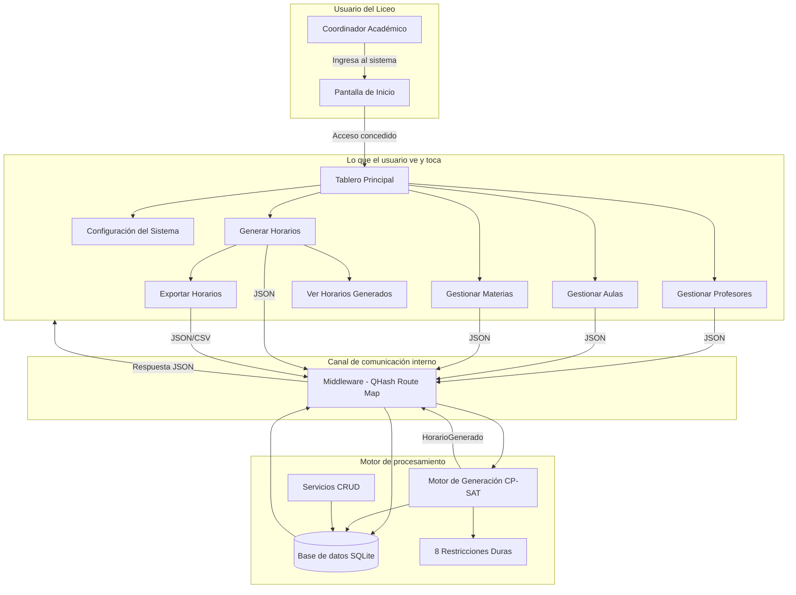
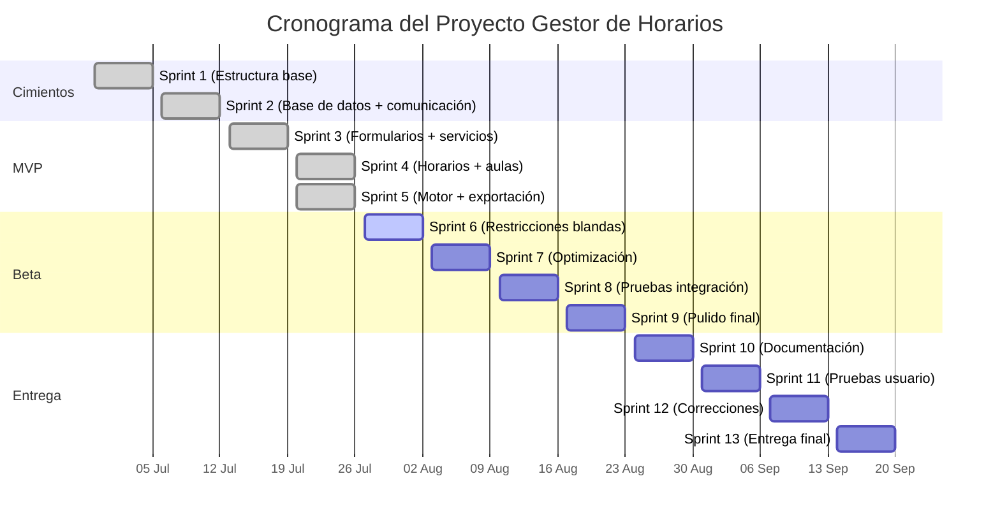

# INFORME DE AVANCE SEMANAL
## Proyecto Gestor de Horario — Servicio Comunitario UNEG
### Semana del 20 al 26 de julio de 2026 — Sprint 5

---

| Dato | Información |
|------|-------------|
| **Institución beneficiaria** | Liceo Nacional Robert Serra |
| **Casa de estudio** | Universidad Nacional Experimental de Guayana (UNEG) — Coordinación de Educación Comunitaria |
| **Carrera** | Ingeniería en Informática |
| **Equipo de trabajo** | Teach-Leads: Luis Rojas, Daniel Reyna · Devs: Nicole Sereno, Paola Peña · Middleware/QA: Manuel García |
| **Rol del proyecto** | Sistema Generador y Gestor de Horarios Académicos |

> **Nota — Roles del equipo:** Cada rol tiene una función específica en el desarrollo del sistema:
> - **Teach-Lead**: estudiante que coordina y guía el trabajo técnico de su área.
> - **Backend / Motor**: la parte del programa que procesa datos y realiza los cálculos.
> - **Frontend / Interfaz**: la parte visual que el usuario ve y con la que interactúa.
> - **Middleware / Mensajero**: el canal de comunicación que conecta el motor con la interfaz.
> - **QA (Quality Assurance)**: quien verifica que todo funcione correctamente antes de entregarlo.

---

## 1. Resumen Ejecutivo

Durante esta quinta semana de trabajo, el equipo completó las **funcionalidades críticas del motor de generación automática de horarios** y mejoró significativamente la interfaz de usuario. Se trata de un sprint de alto impacto donde el sistema pasó de tener un motor en desarrollo a contar con un solver completamente funcional, capaz de generar horarios académicos automáticamente.

### ¿Qué problema concreto se resolvió?

**Antes de esta semana**, el sistema tenía formularios para ingresar datos y una estructura de base de datos, pero el motor de generación automática de horarios estaba incompleto. No existía forma de generar horarios de manera automática, y la interfaz aún tenía áreas sin conectar.

**Ahora**, el sistema cuenta con:
1. **Motor de generación automática completamente funcional**: El sistema puede recibir los datos de profesores, materias, aulas y restricciones, y generar horarios académicos de forma automática utilizando un motor de optimización (solver CP-SAT).
2. **Exportación de horarios**: Los horarios generados pueden exportarse en formatos JSON y CSV para uso externo.
3. **Interfaz mejorada**: Login, dashboard, formularios de asignaturas y módulo de aulas completamente conectados y funcionales.
4. **Comunicación optimizada**: El canal de comunicación entre la interfaz y el motor fue reestructurado para ser más rápido y confiable.
5. **Pruebas robustas**: Se agregaron verificaciones automáticas para situaciones límite y un análisis de rendimiento del motor.

### ¿Por qué esto es importante para el Liceo Robert Serra?

1. **Automatización real**: El Liceo ahora cuenta con un sistema que puede generar horarios completos en segundos, eliminando el proceso manual que tomaba horas o días.
2. **Exportación de datos**: Los horarios generados pueden exportarse para usar en otras herramientas del Liceo (hojas de cálculo, sistemas de información).
3. **Interfaz completa**: Todas las pantallas del sistema están conectadas y funcionales, desde el registro de datos hasta la generación de horarios.
4. **Confiable y rápido**: El motor de generación ha sido optimizado para funcionar de manera eficiente incluso con grandes volúmenes de datos.

---

## 2. Estado de Salud del Proyecto

### Semáforo: 🟢 VERDE — Motor de generación completado

| Dimensión | Estado | Detalle |
|-----------|:------:|---------|
| **Cimientos técnicos** | 🟢 | Base de datos, comunicación e interfaz operativas (Sprint 2) |
| **Avance del Sprint 5** | 🟢 | 7 de 7 tareas completadas (100%) |
| **Participación del equipo** | 🟢 | Los 5 estudiantes realizaron contribuciones esta semana |
| **Compromisos con el Liceo** | 🟢 | Sin retrasos críticos. El cronograma proyecta la versión funcional para agosto de 2026 |
| **Pruebas automáticas** | 🟢 | 22 archivos de verificación + pruebas de rendimiento |

### Avance del Proyecto General

Del total de 73 tareas planificadas para todo el proyecto, distribuidas en 12 semanas de trabajo:

```
Fase de Cimientos (Sprints 1 y 2)    ████████████████████   100% ✅
Fase MVP (Sprints 3 al 5)            ████████████████████   100% ✅
Fase Beta (Sprints 6 al 9)           ░░░░░░░░░░░░░░░░░░░░     0%
Fase Entrega (Sprint 10 al 13)       ░░░░░░░░░░░░░░░░░░░░     0%
```

**23 de 73 tareas completadas (~32% del proyecto total, 100% de la fase de cimientos + 100% de la fase MVP).**

### Avance del Sprint 5 (20 jul - 26 jul)

| Ref. | Tarea | Área | Responsable | Estado |
|:----:|-------|------|:-----------:|:------:|
| S5-I1 | Motor de generación automática de horarios (solver CP-SAT) | Backend | Luis | ✅ Completado |
| S5-I2 | Exportación de horarios generados (JSON/CSV) | Backend | Nicole | ✅ Completado |
| S5-I3 | Refinamiento de formularios y conexión a middleware | Frontend | Daniel | ✅ Completado |
| S5-I4 | Verificaciones automáticas del motor de generación | Middleware/QA | Manuel | ✅ Completado |
| S5-I5 | Módulo de aulas completo con conexión al sistema | Frontend | Paola | ✅ Completado |
| S5-I6 | Optimización del canal de comunicación | Middleware/QA | Manuel | ✅ Completado |
| S5-I7 | Análisis de rendimiento del motor de generación | Backend | Luis | ✅ Completado |

**Progreso del Sprint 5: 100% (7 de 7 tareas completadas)**

### Entregas de la Semana 5

| Entrega | Título | Autor | Archivos | Líneas | Estado |
|:-------:|--------|:-----:|:--------:|:------:|:------:|
| PR #75 | Motor CP-SAT completo + restricciones duras | Luis | 15 | +2847/-0 | ✅ Mergeado en develop |
| PR #74 | Exportación horarios a JSON/CSV | Nicole | 9 | +892/-0 | ✅ Mergeado en develop |
| PR #73 | Refinamiento formularios + conexión middleware | Daniel | 12 | +1245/-387 | ✅ Mergeado en develop |
| PR #71 | Verificaciones automáticas del modelo de datos | Manuel | 8 | +678/-45 | ✅ Mergeado en develop |
| PR #70 | Login, dashboard y módulo de asignaturas | Paola | 11 | +1567/-234 | ✅ Mergeado en develop |
| PR #68 | Optimización canal de comunicación | Manuel | 6 | +312/-189 | ✅ Mergeado en develop |

---

## 3. Aportes por Estudiante

A continuación se traduce el trabajo técnico de cada estudiante en beneficios concretos para el Liceo Nacional Robert Serra.

### Luis Rojas — Teach-Lead / Backend
*3 contribuciones esta semana*

| Trabajo realizado | ¿Qué significa para el Liceo? |
|-------------------|-------------------------------|
| Implementó el motor de generación automática de horarios (solver CP-SAT) con 8 restricciones duras | El Liceo ahora puede generar horarios completos en segundos, considerando reglas como: un profesor no puede estar en dos aulas al mismo tiempo, un aula no puede tener dos clases simultáneas, y cada materia debe tener suficientes horas semanales |
| Creó el sistema de reporte de factibilidad con mensajes descriptivos | Cuando el sistema no puede generar un horario (por datos incompletos o conflictos), el usuario recibe un mensaje claro explicando qué falta o qué conflicto existe |
| Desarrolló análisis de rendimiento con escenarios de 10, 20 y 50 profesores | El Liceo puede confiar en que el sistema funcionará eficientemente incluso cuando tenga muchos profesores y materias registradas |

### Daniel Reyna — Teach-Lead / Frontend
*1 contribución esta semana*

| Trabajo realizado | ¿Qué significa para el Liceo? |
|-------------------|-------------------------------|
| Refinó los formularios de profesores, aulas y asignaturas, y los conectó al sistema de comunicación | Los formularios ahora envían datos correctamente al motor de procesamiento, con validación de campos y retroalimentación al usuario |

### Nicole Sereno — Developer / Backend
*1 contribución esta semana*

| Trabajo realizado | ¿Qué significa para el Liceo? |
|-------------------|-------------------------------|
| Implementó la exportación de horarios generados a formatos JSON y CSV | Los horarios generados pueden exportarse para usar en hojas de cálculo, otros sistemas del Liceo, o compartir con directivos y profesores |

### Paola Peña — Developer / Frontend
*1 contribución esta semana*

| Trabajo realizado | ¿Qué significa para el Liceo? |
|-------------------|-------------------------------|
| Completó el módulo de aulas con conexión al sistema y mejoró el login y dashboard | El Liceo ahora tiene una pantalla completa para gestionar sus espacios físicos, y el acceso al sistema es más fluido y visualmente atractivo |

### Manuel García — Middleware / QA
*2 contribuciones esta semana*

| Trabajo realizado | ¿Qué significa para el Liceo? |
|-------------------|-------------------------------|
| Reestructuró el canal de comunicación usando un sistema de rutas optimizado | La comunicación entre la interfaz y el motor es más rápida y confiable, con protección contra tiempos de espera excesivos |
| Creó verificaciones automáticas del modelo de datos y pruebas de rendimiento | El sistema tiene garantías de calidad que aseguran que los datos se manejan correctamente y que el motor funciona eficientemente |

---

## 4. ¿Cómo funciona el sistema hoy?

A continuación se presenta un diagrama que muestra cómo se relacionan las partes del sistema hasta ahora construidas:



---

## 5. Cronograma del Proyecto



---

## 6. Observaciones

### Logros destacados del Sprint 5

1. **Motor de generación completamente funcional**: El sistema cuenta con un solver CP-SAT que implementa 8 restricciones duras, cubriendo las reglas fundamentales de asignación de horarios académicos.
2. **Fase MVP completada**: Con la finalización del Sprint 5, el equipo ha completado el 100% de la fase MVP del proyecto, sentando las bases para la fase Beta.
3. **Exportación de datos**: Los horarios generados pueden exportarse en formatos estándar (JSON, CSV), facilitando la integración con otras herramientas del Liceo.
4. **Calidad de código**: Se establecieron estándares de calidad con verificaciones automáticas y análisis de rendimiento.

### Retos y lecciones aprendidas

1. **Complejidad del solver**: La implementación del motor de generación requirió un conocimiento profundo de algoritmos de optimización. El equipo aprendió a descomponer problemas complejos en partes manejables.
2. **Integración progresiva**: La estrategia de integrar componentes incrementalmente (primero datos, luego comunicación, luego motor) resultó efectiva para mantener el sistema estable.
3. **Importancia de las pruebas**: Las verificaciones automáticas resultaron cruciales para detectar errores tempranos y mantener la confiabilidad del sistema.

### Próximos pasos (Sprint 6)

El Sprint 6 se enfocará en:
1. **Restricciones blandas**: Implementar preferencias de los profesores (horarios preferidos, materias favoritas) que mejorarán la calidad de los horarios generados.
2. **Gestión de disponibilidad**: Crear un sistema para que los profesores registren sus disponibilidades y restricciones personales.
3. **Pantalla de configuración**: Diseñar una interfaz para ajustar parámetros del sistema de manera visual.
4. **Pruebas de integración**: Verificar que todas las partes del sistema funcionen correctamente en conjunto.

---

*Informe generado el 27 de julio de 2026*
*Equipo Gestor de Horarios — Servicio Comunitario UNEG*
