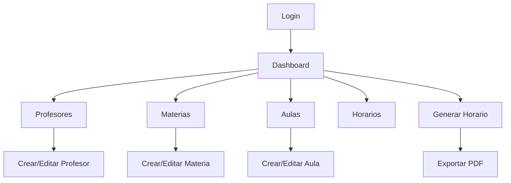

# Propuesta: Enriquecimiento Técnico de Issues Sprint 3

> Documento que especifica, para cada issue de Sprint 3, el contenido exacto del campo `Contexto Técnico`, los criterios de aceptación mejorados, el orden de prioridad, y el análisis de riesgos.

---

## Tabla de Contenidos

1. [Prioridad y Dependencias](#1-prioridad-y-dependencias)
2. [S3-I1 (#20) — Modelo de datos entidades + diagrama ER](#2-s3-i1-20--backend-modelo-de-datos-entidades--diagrama-er)
3. [S3-I4 (#19) — Enrutamiento CRUD frontend → backend](#3-s3-i4-19--middleware-enrutamiento-crud-frontend--backend)
4. [S3-I2 (#21) — CRUD de materias](#4-s3-i2-21--backend-crud-de-materias)
5. [S3-I5 (#23) — CRUD de aulas](#5-s3-i5-23--backend-crud-de-aulas)
6. [S3-I3 (#17) — Formulario de registro de profesores](#6-s3-i3-17--frontend-formulario-de-registro-de-profesores)
7. [S3-I6 (#18) — Prototipos dashboard + flujo de navegación](#7-s3-i6-18--frontend-prototipos-dashboard--flujo-de-navegación)
8. [Resumen de Riesgos](#8-resumen-de-riesgos)

---

## 1. Prioridad y Dependencias

### Grafo de dependencias (Sprint 3)

```
S3-I1 (#20) Modelo ER ──┬── sin bloqueados directos
                         │
S3-I6 (#18) Dashboard ──┘── sin bloqueados directos (frontend puro)

S3-I4 (#19) CRUD Routing ─── bloquea a S3-I2, S3-I5, S3-I3
                │
                ├── S3-I2 (#21) Subject CRUD (needs op constants + routing)
                ├── S3-I5 (#23) Classroom CRUD (needs op constants + routing)
                └── S3-I3 (#17) Teacher Form (needs real routing → real backend calls)
```

### Orden de ejecución recomendado

| Orden | Issue | Asignado | ¿Por qué aquí? |
|-------|-------|----------|----------------|
| **1** | S3-I1 (#20) ER Model | Luis | Sin dependencias. Diseño upstream. Define el contrato relacional que usan todos los CRUD. |
| **2** | S3-I4 (#19) CRUD Routing | Manuel | Define las constantes `subject_*`, `classroom_*` en `messages.h` y el mapa de rutas. Sin esto, los CRUD no tienen IPC. |
| **3** | S3-I6 (#18) Dashboard | Dani+Paola | Sin dependencias de backend. Puede hacerse en paralelo con S3-I4. |
| **4** | S3-I2 (#21) Subject CRUD | Nicole | Usa las op constants y el route map de S3-I4. Crea tabla, servicio, tests. |
| **5** | S3-I5 (#23) Classroom CRUD | Nicole | Misma lógica que S3-I2. Puede hacerse en paralelo con S3-I2. |
| **6** | S3-I3 (#17) Teacher Form | Paola | Depende de S3-I4 para tener routing real (no placeholder). Necesita el backend CRUD funcionando. |

### Calendarización sugerida (29 Jun - 5 Jul)

| Día | Lunes 29 | Martes 30 | Miércoles 1 | Jueves 2 | Viernes 3 | Sábado 4 | Domingo 5 |
|-----|----------|-----------|-------------|----------|-----------|----------|-----------|
| Luis | S3-I1 | S3-I1 | Review | Review | — | — | — |
| Manuel | S3-I4 | S3-I4 | S3-I4 | Review | — | — | — |
| Dani+Paola | S3-I6 | S3-I6 | S3-I6 | S3-I3 | S3-I3 | S3-I3 | Review |
| Nicole | — | — | S3-I2 | S3-I2+I5 | S3-I5 | S3-I5 | Review |

---

## 2. S3-I1 (#20) — [Backend] Modelo de datos entidades + diagrama ER

### Contexto Técnico (contenido exacto a inyectar en el issue)

```markdown
## Contexto Técnico

### ⚠️ Distinción crítica: solver structs vs. persistence entities

El proyecto maneja DOS capas de representación de datos que NO DEBEN confundirse:

1. **Solver/Domain structs** (existentes en `src/backend/include/backend/data/`): son structs C++ para el modelado CP-SAT de OR-Tools. NO tienen campo `id`. Tienen `toJson()`/`fromJson()` para IPC. Archivos:
   - `aula.hpp` — campos: `nombre`, `capacidad`, `locacion`
   - `materia.hpp` — campos: `nombre`, `horas_semanales`, `requerimientos` (QVector<QString>)
   - `profesor.hpp` — campos: `nombre`, `disponibilidad` (QVector<FranjaHoraria>), `materias` (QVector<QString>)
   - `franja_horaria.hpp` — campos: `dia`, `hora_inicio`, `hora_fin`
   - `horario.hpp`, `plan_estudio.hpp`
   - Ubicación: `src/backend/include/backend/data/` — implementaciones en `src/backend/src/data/`
   - CMake registrado en `src/backend/CMakeLists.txt` (líneas 15-21)

2. **Persistence entities** (a crear en Sprint 3): tablas SQLite con `id INTEGER PRIMARY KEY AUTOINCREMENT`. Tienen su propia serialización JSON para IPC. Son lo que Nicole usará en S3-I2 y S3-I5.

### Archivos de referencia obligatorios

- **SQLite schema actual**: `src/backend/src/database/DatabaseManager.cpp` (líneas 80-137)
  - Tabla `teachers`: id, name, email, phone, created_at, updated_at
  - Tabla `classrooms`: id, name, capacity, building, floor, created_at, updated_at
  - Usa `PRAGMA foreign_keys = ON`
  - Sigue el patrón `CREATE TABLE IF NOT EXISTS` + CHECK constraints

- **DatabaseManager header**: `src/backend/include/backend/data/DatabaseManager.hpp`
  - API: `initialize(dbPath)`, `close()`, `database()`, `isInitialized()`
  - Método privado `runMigrations()` donde se agregan nuevas tablas

- **Test de base de datos existente**: `test/backend/test_database.cpp`
  - Usa `QTemporaryDir` para base de datos temporal
  - Verifica tablas con `SELECT name FROM sqlite_master WHERE type='table'`
  - Inserta fila y verifica con `SELECT COUNT(*)`
  - Sigue el patrón QTest (QTEST_MAIN, Q_OBJECT, .moc)

### Entidades requeridas en el ER

El diagrama ER debe capturar:

| Entidad | ¿Existe como solver struct? | ¿Existe como tabla SQLite? |
|---------|---------------------------|---------------------------|
| Teacher/Profesor | ✅ `profesor.hpp` | ✅ `teachers` (S2-I5) |
| Classroom/Aula | ✅ `aula.hpp` | ✅ `classrooms` (S2-I5) |
| Subject/Materia | ✅ `materia.hpp` | ❌ A crear (S3-I2) |
| TimeSlot/FranjaHoraria | ✅ `franja_horaria.hpp` | ❌ Futuro sprint |
| Schedule/Horario | ✅ `horario.hpp` | ❌ Futuro sprint |
| PlanEstudio | ✅ `plan_estudio.hpp` | ❌ Futuro sprint |

Relaciones documentadas en `docs/guias/planificacion/issues-detalladas.md` (líneas 240-245):
- Teacher ↔ Subject (N:M) → tabla pivote `teacher_subjects`
- Schedule → Teacher + Subject + Classroom + TimeSlot

### Documentación a consultar

- `docs/guias/arquitectura/arquitectura-comunicacion-frontend-backend.md` — Arquitectura IPC
- `docs/guias/desarrollo/CMAKE_GUIDE.md` — Convenciones CMake
- `docs/guias/desarrollo/TESTING_GUIDE.md` — Convenciones de test
- `docs/refactor-binario-unico.md` — Arquitectura del binario único

### Formato del diagrama ER

Crear en `docs/er-diagram.md` usando sintaxis Mermaid. Referencia: `docs/guias/planificacion/issues-detalladas.md` línea 243.

### Testing

- Test unitario que crea instancias de TODAS las entidades C++ y verifica:
  - Serialización JSON round-trip (toJson → fromJson → toJson)
  - Relaciones N:M correctamente inicializadas (vectores vacíos, asignación)
- Usar QTest como los tests existentes en `test/backend/test_materia.cpp`
- Agregar test al `test/CMakeLists.txt` con `add_qtest()`
```

### Criterios de Aceptación mejorados

```markdown
- [ ] Diagrama ER completo (archivo `docs/er-diagram.md`) con todas las entidades, atributos, tipos de datos y relaciones (1:1, 1:N, N:M con tablas pivote)
- [ ] Mermaid diagram renderizable con tipos de datos SQL (INTEGER, TEXT, etc.)
- [ ] Modelo C++ refleja el diagrama E-R: cada entidad tiene su struct/class correspondiente
- [ ] Relaciones N:M correctamente modeladas con tablas pivote (ej: teacher_subjects)
- [ ] Serialización JSON round-trip para TODAS las entidades (toJson → fromJson → toJson produce el mismo objeto)
- [ ] La distinción entre solver structs (sin id) y persistence entities (con id) está EXPLÍCITAMENTE documentada en el ER
- [ ] Test unitario que crea un grafo completo de entidades interconectadas (Profesor con 2 materias, Aula con capacidad > 0, etc.)
- [ ] Cobertura de test ≥ 80% para métodos toJson/fromJson de cada entidad
- [ ] CHECK constraints documentadas para cada campo (NOT NULL, UNIQUE, CHECK positivo, etc.)
- [ ] Update `src/backend/CMakeLists.txt` si se agregan nuevos archivos .hpp/.cpp
```

### Riesgos

| Riesgo | Probabilidad | Mitigación |
|--------|-------------|------------|
| Confundir solver structs con persistence entities | Alta | Documentar explícitamente la diferencia en el ER y en los comentarios de código |
| Diagrama ER demasiado genérico sin tipos SQL concretos | Media | Usar Mermaid con anotaciones de tipo SQL en cada atributo |
| No cubrir todos los casos de uso del sistema | Media | Validar contra la lista de pantallas del frontend (S3-I6) |

---

## 3. S3-I4 (#19) — [Middleware] Enrutamiento CRUD frontend → backend

### Contexto Técnico (contenido exacto a inyectar en el issue)

```markdown
## Contexto Técnico

### Estado actual del middleware

**Archivos existentes:**

1. `src/middleware/include/middleware/messages.h` — Define operaciones y códigos de respuesta:
   - Constantes de operación (líneas 21-40):
     - `OP_HEALTH_CHECK = "health_check"`
     - `OP_LISTO = "ready"`, `OP_APAGAR = "shutdown"`
     - `OP_LISTA_PROFESORES = "teacher_list"`
     - `OP_OBTENER_PROFESOR = "teacher_get"`
     - `OP_CREAR_PROFESOR = "teacher_create"`
     - `OP_ACTUALIZAR_PROFESOR = "teacher_update"`
     - `OP_ELIMINAR_PROFESOR = "teacher_delete"`
   - Códigos de respuesta (líneas 45-53):
     - `RESP_EXITO = 0`, `RESP_ERROR = -1`
     - `RESP_NO_ENCONTRADO = -2`, `RESP_TIEMPO_AGOTADO = -3`
     - `RESP_INVALIDO = -4`
   - **MISSING**: constantes `subject_*` y `classroom_*` (debes agregarlas)

2. `src/middleware/src/server/internalserver.cpp` — Enrutador actual:
   - `onReadyRead()` (líneas 69-117): parsea JSON del socket, identifica op por `obj["op"]`
   - Usa cadena if-else (NO switch por ser QString)
   - Las operaciones teacher_* actualmente retornan placeholder `{"status":"ok","code":0}` (NO ejecutan lógica real)

### Formato del mensaje IPC (contrato)

**Request** (Frontend → Middleware):
```json
{
    "op": "teacher_list",
    "payload": {
        "id": 1,
        "name": "Juan Perez",
        "email": "juan@example.com"
    }
}
```

**Response** (Middleware → Frontend):
```json
{
    "status": "ok",
    "code": 0,
    "op": "teacher_list",
    "data": { ... }
}
```

**Response error**:
```json
{
    "status": "error",
    "code": -1,
    "op": "teacher_list",
    "error": "descripción del error"
}
```

### Lo que debes implementar

#### 1. Agregar constantes de operación a `messages.h`

Siguiendo el patrón existente de `teacher_*`:

```cpp
// ─── Operaciones CRUD Materias ───────────────────────────────────
inline const QString OP_LISTA_MATERIAS    = QStringLiteral("subject_list");
inline const QString OP_OBTENER_MATERIA   = QStringLiteral("subject_get");
inline const QString OP_CREAR_MATERIA     = QStringLiteral("subject_create");
inline const QString OP_ACTUALIZAR_MATERIA = QStringLiteral("subject_update");
inline const QString OP_ELIMINAR_MATERIA   = QStringLiteral("subject_delete");

// ─── Operaciones CRUD Aulas ──────────────────────────────────────
inline const QString OP_LISTA_AULAS    = QStringLiteral("classroom_list");
inline const QString OP_OBTENER_AULA   = QStringLiteral("classroom_get");
inline const QString OP_CREAR_AULA     = QStringLiteral("classroom_create");
inline const QString OP_ACTUALIZAR_AULA = QStringLiteral("classroom_update");
inline const QString OP_ELIMINAR_AULA   = QStringLiteral("classroom_delete");
```

#### 2. Refactorizar el enrutador (`internalserver.cpp`)

Reemplazar la cadena if-else con un route map extensible:

**Opción A (recomendada)**: `QHash<QString, std::function<>>` o `QMap`

```cpp
// En el constructor o método init():
m_routeMap[OP_LISTA_PROFESORES] = [this](const QJsonObject& req) { return handleTeacherList(req); };
m_routeMap[OP_CREAR_PROFESOR]   = [this](const QJsonObject& req) { return handleTeacherCreate(req); };
// ... etc

// En onReadyRead():
auto it = m_routeMap.find(op);
if (it != m_routeMap.end()) {
    respuesta = it.value()(obj);
} else {
    respuesta["status"] = "error";
    respuesta["code"] = RESP_INVALIDO;
}
```

**Opción B**: Tabla de despacho con función virtual + herencia.

#### 3. Implementar handlers reales

Los handlers teacher_* actualmente deben DELEGAR en el backend. Sin embargo, como backend y middleware están en el mismo proceso (binario único), los handlers pueden llamar al servicio directamente.

```cpp
QJsonObject InternalServer::handleTeacherCreate(const QJsonObject& req) {
    QJsonObject payload = req["payload"].toObject();
    // TODO: validar payload
    // TODO: llamar a TeacherService::create(...) — cuando exista
    QJsonObject resp;
    resp["status"] = "ok";
    resp["code"] = RESP_EXITO;
    resp["op"] = OP_CREAR_PROFESOR;
    return resp;
}
```

Para Sprint 3, los handlers pueden seguir siendo placeholders que devuelvan `{"status":"ok"}` mientras Nicole implementa los servicios reales en S3-I2 y S3-I5.

#### 4. Timeout de 5s

Agregar mecanismo de timeout por operación. Referencia: `test/test_health_check.cpp` (línea 36) — ya existe `QTimer::singleShot(5000, &a, &QCoreApplication::quit)` como patrón.

### Archivos a modificar

- `src/middleware/include/middleware/messages.h` — Agregar subject_* y classroom_* constants
- `src/middleware/include/middleware/internalserver.h` — Agregar QHash/QMap route map, nuevos métodos handle*
- `src/middleware/src/server/internalserver.cpp` — Refactorizar onReadyRead(), implementar route map
- `test/test_health_check.cpp` — Extender test para probar nuevas rutas

### Patrón a seguir

- `src/middleware/src/client/internalclient.cpp` — Muestra el patrón de construcción de request JSON (líneas 62-68)
- `src/middleware/include/middleware/internalclient.h` — API del cliente (líneas 57-58)
- `test/test_health_check.cpp` — Test E2E que lanza server, conecta cliente, verifica respuesta

### Dependencias con otros issues

- **S3-I2 (#21)** y **S3-I5 (#23)**: Nicole usará las constantes `subject_*` y `classroom_*` que definas. Deben estar listas ANTES de que Nicole empiece.
- **S3-I3 (#17)**: Paola usará el routing de `teacher_*` para el formulario de profesores. Los handlers deben responder correctamente.

### Testing

- Test E2E (como `test/test_health_check.cpp`) para cada nueva operación
- Verificar que ops inválidas retornan RESP_INVALIDO (-4)
- Verificar timeout de 5s si backend no responde
- Verificar que el route map es extensible: agregar nueva op no requiere modificar el dispatch central
```

### Criterios de Aceptación mejorados

```markdown
- [ ] Constantes `subject_*` y `classroom_*` agregadas a `messages.h` siguiendo el patrón `teacher_*`
- [ ] Route map implementado con QHash/QMap (sin if-else para cada operación)
- [ ] Handler para cada operación existente (teacher_*, subject_*, classroom_*) que retorna `{"status":"ok","code":0}`
- [ ] Ops inválidas retornan `{"status":"error","code":-4}` (RESP_INVALIDO)
- [ ] Timeout global de 5s por operación que retorna RESP_TIEMPO_AGOTADO (-3)
- [ ] Agregar nueva entidad al route map requiere SOLO registrar su handler — sin modificar el dispatch central
- [ ] Test E2E para health_check, teacher_list, subject_list, classroom_list (mínimo 4 tests)
- [ ] Test que verifica que op desconocida retorna RESP_INVALIDO
- [ ] Documentación en `src/middleware/README.md` del contrato de mensajes (formato request/response)
- [ ] CMake: no requiere cambios (middleware ya linkea Qt6::Network)
- [ ] El código sigue el patrón de `clean-code`: nombres descriptivos, funciones pequeñas, sin comentarios redundantes
```

### Riesgos

| Riesgo | Probabilidad | Mitigación |
|--------|-------------|------------|
| Route map se vuelve complejo con muchas entidades | Baja | Diseñar con QHash desde el inicio; el patrón es inherentemente extensible |
| Los handlers teacher_* rompen algo existente | Media | Mantener compatibilidad hacia atrás; los tests E2E existentes deben seguir pasando |
| Nicole no puede empezar S3-I2 hasta tener las op constants | Alta | Manuel debe mergear `messages.h` primero, aunque el routing no esté completo |
| Timeout mal implementado causa falsos positivos | Media | Usar QTimer con singleShot, probar con latencia artificial |

---

## 4. S3-I2 (#21) — [Backend] CRUD de materias

### Contexto Técnico (contenido exacto a inyectar en el issue)

```markdown
## Contexto Técnico

### Naturaleza de este issue

Este es un CRUD de **persistencia** (base de datos SQLite), NO de modelado CP-SAT. Las materias deben almacenarse con `id` y operaciones CRUD completas. El solver struct `Materia` (sin id) se usa para el motor de optimización; la entidad de base de datos (con id) es separada.

### Archivos existentes de referencia

#### 1. DatabaseManager — patrón de schema SQLite

`src/backend/include/backend/data/DatabaseManager.hpp` y `src/backend/src/database/DatabaseManager.cpp`

El método `runMigrations()` (líneas 80-137) usa `CREATE TABLE IF NOT EXISTS`. Sigue este patrón:

```cpp
if (!query.exec(
    "CREATE TABLE IF NOT EXISTS subjects ("
    "id INTEGER PRIMARY KEY AUTOINCREMENT,"
    "name TEXT NOT NULL,"
    "weekly_hours INTEGER NOT NULL CHECK(weekly_hours > 0),"
    "required_classroom_type TEXT,"
    "department TEXT,"
    "created_at TEXT NOT NULL DEFAULT CURRENT_TIMESTAMP,"
    "updated_at TEXT NOT NULL DEFAULT CURRENT_TIMESTAMP"
    ")"
)) {
    qCritical() << "Error creando tabla subjects:" << query.lastError().text();
    return false;
}
```

#### 2. Solver struct Materia (NO tocar, solo referenciar)

`src/backend/include/backend/data/materia.hpp` — estructura actual del solver:

```cpp
struct Materia {
    QString nombre;
    int horas_semanales;
    QVector<QString> requerimientos;
    QJsonObject toJson() const;
    static Materia fromJson(const QJsonObject& obj);
};
```

#### 3. Test existente de Materia

`test/backend/test_materia.cpp` — test de serialización round-trip (toJson → fromJson → toJson). Usa QTest. Patrón a replicar para el servicio CRUD.

### Lo que debes crear/modificar

#### 1. Tabla `subjects` en `DatabaseManager.cpp`

Agregar en `runMigrations()` una nueva tabla `subjects` con los campos definidos arriba. No modifiques las tablas existentes `teachers` y `classrooms`.

#### 2. Servicio `SubjectService`

Crear `src/backend/src/services/SubjectService.cpp` con header en `src/backend/include/backend/services/SubjectService.hpp`:

```cpp
#pragma once
#include <QJsonObject>
#include <QJsonArray>
#include <QSqlDatabase>

class SubjectService {
public:
    explicit SubjectService(QSqlDatabase& db);
    
    QJsonObject create(const QJsonObject& data);
    QJsonObject get(int id);
    QJsonArray list();
    QJsonObject update(int id, const QJsonObject& data);
    bool remove(int id);
    
private:
    QSqlDatabase& m_db;
    QJsonObject toJson(const QSqlQuery& query); // helper para convertir fila → JSON
};
```

**Patrón de implementación** (usando QSqlQuery con parámetros vinculados para prevenir SQL injection):

```cpp
QJsonObject SubjectService::create(const QJsonObject& data) {
    QSqlQuery query(m_db);
    query.prepare(
        "INSERT INTO subjects (name, weekly_hours, required_classroom_type, department) "
        "VALUES (:name, :weekly_hours, :required_classroom_type, :department)"
    );
    query.bindValue(":name", data["name"].toString());
    query.bindValue(":weekly_hours", data["weekly_hours"].toInt());
    query.bindValue(":required_classroom_type", data["required_classroom_type"].toString());
    query.bindValue(":department", data["department"].toString());
    
    if (!query.exec()) {
        return {{"status", "error"}, {"error", query.lastError().text()}};
    }
    
    return get(query.lastInsertId().toInt());
}
```

#### 3. Validación de datos

El servicio debe validar antes de insertar/actualizar:
- `name`: NOT NULL, no vacío, longitud máxima 200
- `weekly_hours`: entero positivo (> 0, <= 40)
- `required_classroom_type`: string opcional (puede ser "aula", "laboratorio", "taller")
- `department`: string opcional

Respuesta de error de validación:
```json
{
    "status": "error",
    "code": -4,
    "error": "El campo 'name' es obligatorio"
}
```

#### 4. Mensajes IPC

Usa las constantes definidas por Manuel en S3-I4 (messages.h):
- `OP_LISTA_MATERIAS = "subject_list"`
- `OP_OBTENER_MATERIA = "subject_get"`
- `OP_CREAR_MATERIA = "subject_create"`
- `OP_ACTUALIZAR_MATERIA = "subject_update"`
- `OP_ELIMINAR_MATERIA = "subject_delete`

Formato request (desde el frontend vía middleware):
```json
{
    "op": "subject_create",
    "payload": {
        "name": "Matemáticas",
        "weekly_hours": 5,
        "required_classroom_type": "aula",
        "department": "Ciencias"
    }
}
```

Formato response:
```json
{
    "status": "ok",
    "code": 0,
    "op": "subject_create",
    "data": {
        "id": 1,
        "name": "Matemáticas",
        "weekly_hours": 5,
        "required_classroom_type": "aula",
        "department": "Ciencias",
        "created_at": "2026-06-29 10:00:00",
        "updated_at": "2026-06-29 10:00:00"
    }
}
```

#### 5. CMake

Registrar los nuevos archivos en `src/backend/CMakeLists.txt`:
```cmake
# En target_sources(backend PRIVATE ...)
src/services/SubjectService.cpp
```

### Testing

Crear `test/backend/test_subject_service.cpp` usando QTest:
- Test CRUD completo: crear materia → verificar campo → actualizar → verificar cambio → listar → eliminar → verificar que ya no existe
- Test de validación: nombre vacío, weekly_hours negativo, tipo inválido
- Test de integración con DatabaseManager (usar QTemporaryDir como en `test/backend/test_database.cpp`)
- Test de serialización JSON round-trip para SubjectService

Agregar al `test/CMakeLists.txt`:
```cmake
add_qtest(test_backend_subject_service
    backend/test_subject_service.cpp
    backend
    Qt6::Sql
)
```

### Documentación a consultar

- `docs/guias/desarrollo/CMAKE_GUIDE.md` — Cómo agregar nuevos sources al build
- `docs/guias/desarrollo/TESTING_GUIDE.md` — Convenciones QTest vs GoogleTest
- `test/backend/test_database.cpp` — Patrón de test con QTemporaryDir
```

### Criterios de Aceptación mejorados

```markdown
- [ ] Tabla `subjects` creada en `runMigrations()` de DatabaseManager (sin modificar tablas existentes)
- [ ] SubjectService con CRUD completo: create, get, list, update, remove
- [ ] Validación de datos en create/update: name requerido, weekly_hours > 0, tipos correctos
- [ ] SQL injection prevenido: todas las queries usan `prepare()` con `bindValue()` (nunca concatenación de strings)
- [ ] Códigos de respuesta IPC correctos: RESP_EXITO (0) en éxito, RESP_INVALIDO (-4) en validación
- [ ] Manejador de errores: campos opcionales aceptan valores vacíos sin crash
- [ ] Timestamps created_at/updated_at se actualizan automáticamente
- [ ] updated_at se modifica en cada UPDATE
- [ ] Test unitario con cobertura CRUD completo (crear, leer, actualizar, eliminar)
- [ ] Test de validación de datos inválidos
- [ ] Test de integración con DatabaseManager (QTemporaryDir)
- [ ] Código registrado en `src/backend/CMakeLists.txt` y test registrado en `test/CMakeLists.txt`
- [ ] Build exitoso sin warnings
```

### Riesgos

| Riesgo | Probabilidad | Mitigación |
|--------|-------------|------------|
| Confundir solver struct Materia con persistencia de Subject | Alta | Documentar que SubjectService usa tabla SQLite con id; Materia struct es para CP-SAT sin id |
| No tener las op constants de subject_* listas (S3-I4 no mergeado) | Alta | Coordinar con Manuel: aunque no esté el route map completo, las constantes en messages.h deben mergearse primero |
| Validación insuficiente de tipos de datos | Media | Agregar CHECK constraints en SQL + validación en C++ antes de insertar |
| No considerar la relación Teacher ↔ Subject (N:M) | Media | Documentar que la tabla pivote `teacher_subjects` se creará en un sprint futuro |

---

## 5. S3-I5 (#23) — [Backend] CRUD de aulas

### Contexto Técnico (contenido exacto a inyectar en el issue)

```markdown
## Contexto Técnico

### Nota importante

La tabla `classrooms` YA EXISTE en la base de datos (creada en S2-I5 por Nicole). Este issue debe:
1. Crear el servicio `ClassroomService` con operaciones CRUD sobre la tabla existente
2. Agregar validación de datos más estricta
3. NO modificar el schema de la tabla (ya fue creado en S2-I5)

### Estado actual de la tabla classrooms

Definida en `src/backend/src/database/DatabaseManager.cpp` (líneas 109-134):

```sql
CREATE TABLE IF NOT EXISTS classrooms (
    id INTEGER PRIMARY KEY AUTOINCREMENT,
    name TEXT NOT NULL UNIQUE,
    capacity INTEGER NOT NULL CHECK(capacity > 0),
    building TEXT,
    floor INTEGER,
    created_at TEXT NOT NULL DEFAULT CURRENT_TIMESTAMP,
    updated_at TEXT NOT NULL DEFAULT CURRENT_TIMESTAMP
)
```

Campos existentes:
- `id` (INTEGER PK AUTOINCREMENT)
- `name` (TEXT NOT NULL UNIQUE) — nombre identificador del aula
- `capacity` (INTEGER NOT NULL, CHECK > 0) — capacidad máxima
- `building` (TEXT, opcional) — edificio
- `floor` (INTEGER, opcional) — piso/nivel
- `created_at`, `updated_at` — timestamps automáticos

### Solver struct Aula (NO tocar)

`src/backend/include/backend/data/aula.hpp`:

```cpp
struct Aula {
    QString nombre;
    int capacidad;
    QString locacion;
    QJsonObject toJson() const;
    static Aula fromJson(const QJsonObject& obj);
};
```

Notar la diferencia: `Aula.nombre ↔ classrooms.name`, `Aula.capacidad ↔ classrooms.capacity`, `Aula.locacion` es más genérico que `building + floor`.

### Lo que debes crear

#### 1. Servicio `ClassroomService`

Crear `src/backend/src/services/ClassroomService.cpp` con header en `src/backend/include/backend/services/ClassroomService.hpp`:

```cpp
#pragma once
#include <QJsonObject>
#include <QJsonArray>
#include <QSqlDatabase>

class ClassroomService {
public:
    explicit ClassroomService(QSqlDatabase& db);
    
    QJsonObject create(const QJsonObject& data);
    QJsonObject get(int id);
    QJsonArray list();
    QJsonObject update(int id, const QJsonObject& data);
    bool remove(int id);
    
private:
    QSqlDatabase& m_db;
    QJsonObject rowToJson(const QSqlQuery& query);
};
```

#### 2. Validación de datos

- `name`: NOT NULL, no vacío, único (la DB ya tiene UNIQUE constraint)
- `capacity`: entero positivo (> 0, <= 500), CHECK constraint en DB
- `building`: string opcional, máximo 100 caracteres
- `floor`: entero opcional, puede ser negativo (sótanos)

#### 3. Mensajes IPC

Usa las constantes de S3-I4:
- `OP_LISTA_AULAS = "classroom_list"`
- `OP_OBTENER_AULA = "classroom_get"`
- `OP_CREAR_AULA = "classroom_create"`
- `OP_ACTUALIZAR_AULA = "classroom_update"`
- `OP_ELIMINAR_AULA = "classroom_delete"`

Formato request:
```json
{
    "op": "classroom_create",
    "payload": {
        "name": "A-101",
        "capacity": 30,
        "building": "Edificio A",
        "floor": 1
    }
}
```

Formato response:
```json
{
    "status": "ok",
    "code": 0,
    "op": "classroom_create",
    "data": {
        "id": 1,
        "name": "A-101",
        "capacity": 30,
        "building": "Edificio A",
        "floor": 1,
        "created_at": "2026-06-29 10:00:00",
        "updated_at": "2026-06-29 10:00:00"
    }
}
```

Respuesta de error (violación UNIQUE):
```json
{
    "status": "error",
    "code": -1,
    "error": "UNIQUE constraint failed: classrooms.name",
    "op": "classroom_create"
}
```

#### 4. Patrón de implementación (QSqlQuery con bindValue)

Seguir el mismo patrón que SubjectService (S3-I2):

```cpp
QJsonObject ClassroomService::create(const QJsonObject& data) {
    QSqlQuery query(m_db);
    query.prepare(
        "INSERT INTO classrooms (name, capacity, building, floor) "
        "VALUES (:name, :capacity, :building, :floor)"
    );
    query.bindValue(":name", data["name"].toString());
    query.bindValue(":capacity", data["capacity"].toInt());
    query.bindValue(":building", data["building"].toString());
    query.bindValue(":floor", data["floor"].isUndefined() ? QVariant() : data["floor"].toInt());
    // floor es opcional: usar QVariant() si no se provee
    
    if (!query.exec()) {
        return {{"status", "error"}, {"error", query.lastError().text()}};
    }
    return get(query.lastInsertId().toInt());
}
```

#### 5. CMake

Registrar en `src/backend/CMakeLists.txt`:
```cmake
src/services/ClassroomService.cpp
```

### Testing

Crear `test/backend/test_classroom_service.cpp`:
- CRUD completo
- Validación: nombre vacío, capacity <= 0, nombre duplicado (UNIQUE)
- Integración con DatabaseManager (QTemporaryDir)
- Serialización JSON round-trip

Registrar en `test/CMakeLists.txt`:
```cmake
add_qtest(test_backend_classroom_service
    backend/test_classroom_service.cpp
    backend
    Qt6::Sql
)
```

### Dependencias

- **messages.h**: esperar a que Manuel (S3-I4) agregue las constantes `classroom_*`
- **DatabaseManager**: tabla `classrooms` ya existe (S2-I5) — no tocar runMigrations()
```

### Criterios de Aceptación mejorados

```markdown
- [ ] ClassroomService con CRUD completo sobre la tabla `classrooms` existente
- [ ] NO se modifica la estructura de la tabla `classrooms` (ya creada en S2-I5)
- [ ] Validación: name requerido y no vacío, capacity > 0, tipos correctos
- [ ] Manejo del error UNIQUE constraint para nombres duplicados
- [ ] SQL injection prevenido: todas las queries con prepare() + bindValue()
- [ ] Códigos de respuesta IPC correctos (RESP_EXITO, RESP_ERROR, RESP_INVALIDO)
- [ ] updated_at se actualiza automáticamente en UPDATE
- [ ] Test unitario CRUD completo
- [ ] Test de validación (datos inválidos)
- [ ] Test de violación UNIQUE (nombre duplicado)
- [ ] Test de integración con DatabaseManager (QTemporaryDir)
- [ ] Código registrado en `src/backend/CMakeLists.txt`
```

### Riesgos

| Riesgo | Probabilidad | Mitigación |
|--------|-------------|------------|
| Modificar accidentalmente la tabla classrooms existente | Alta | NO tocar `runMigrations()`. Solo crear el servicio. |
| Confundir Aula (solver struct, sin id) con classroom (DB entity, con id) | Alta | Documentar en el código: "classroom = persistence entity | aula = solver struct" |
| Violación UNIQUE no manejada gracefulmente | Media | Capturar error en C++ y retornar JSON descriptivo |
| Dependencia de op constants de Manuel | Media | Igual que S3-I2: op constants deben mergearse primero |

---

## 6. S3-I3 (#17) — [Frontend] Formulario de registro de profesores

### Contexto Técnico (contenido exacto a inyectar en el issue)

```markdown
## Contexto Técnico

### Estado actual del frontend

**Archivos existentes:**

1. `src/frontend/src/logindialog.h` / `.cpp` — LoginDialog (QDialog) con username, password, botones login/cancel
2. `src/frontend/src/views/main_window.hpp` / `.cpp` — MainWindow (QMainWindow) con:
   - QStackedWidget como widget central
   - Menubar (Archivo, Ver, Ayuda)
   - Toolbar (Nuevo, Abrir, Guardar)
   - StatusBar
   - Slots: on_action_salir(), on_action_acerca_de()
3. `src/frontend/src/aplicacion_frontend.cpp` — Punto de entrada frontend que muestra LoginDialog y termina
4. `src/frontend/include/frontend/aplicacion_frontend.hpp` — Interfaz de la librería frontend
5. `src/frontend/CMakeLists.txt` — Compila como static library (modo integrado) o executable (FRONTEND_STANDALONE)

### Flujo actual de la aplicación

```
main.cpp → --frontend (default)
  → GestorProcesoBackend::iniciar()  (lanza backend como QProcess)
  → ejecutarAplicacionFrontendImpl()
      → LoginDialog::exec()
          → Accepted → return 0 (sin MainWindow todavía)
          → Rejected → return 1
  → GestorProcesoBackend::detener()
```

### Lo que debes implementar

#### 1. TeacherFormDialog (QDialog)

Crear en `src/frontend/src/forms/teacher_form_dialog.hpp` / `.cpp`:

```
┌─────────────────────────────────┐
│  Registro de Profesor           │
├─────────────────────────────────┤
│  Nombre:    [________________]  │
│  Email:     [________________]  │
│  Teléfono:  [________________]  │
│  Materias:  [Matemáticas][✓]   │
│             [Física]     [✗]   │
│  [Guardar]              [Cancelar]│
└─────────────────────────────────┘
```

**Campos del formulario:**
- `QLineEdit* m_nombreInput` — nombre completo
- `QLineEdit* m_emailInput` — email (con validación de formato)
- `QLineEdit* m_telefonoInput` — teléfono (opcional)
- `QListWidget* m_materiasList` — lista de materias asignadas (con checkboxes o botones +/-)

#### 2. TeacherListWidget (QWidget)

Crear en `src/frontend/src/views/teacher_list_widget.hpp` / `.cpp`:

```
┌─────────────────────────────────┐
│  Profesores Registrados   [+ Nuevo] │
├─────────────────────────────────┤
│  Juan Pérez    juan@mail.com  [✏️][🗑️] │
│  María García  maria@mail.com [✏️][🗑️] │
│  ...                              │
└─────────────────────────────────┘
```

#### 3. Conexión al backend vía InternalClient

Para enviar/recibir datos, debes usar `InternalClient` del módulo middleware:

```cpp
#include <middleware/internalclient.h>

// En el constructor del formulario:
m_client = new InternalClient(this);
connect(m_client, &InternalClient::respuestaRecibida,
        this, &TeacherFormDialog::onRespuestaRecibida);

// Al guardar:
void TeacherFormDialog::onGuardarClicked() {
    QJsonObject payload;
    payload["name"] = m_nombreInput->text();
    payload["email"] = m_emailInput->text();
    payload["phone"] = m_telefonoInput->text();
    m_client->enviarSolicitud(Middleware::OP_CREAR_PROFESOR, payload);
}

// Al recibir respuesta:
void TeacherFormDialog::onRespuestaRecibida(const QJsonObject& respuesta) {
    if (respuesta["status"].toString() == "ok") {
        accept(); // cerrar diálogo con éxito
    } else {
        mostrarError(respuesta["error"].toString());
    }
}
```

**Importante**: InternalClient usa QLocalSocket y necesita que Qt6::Network esté linkeado. El frontend actualmente solo linkea `Qt6::Core` y `Qt6::Widgets`. Debes actualizar `src/frontend/CMakeLists.txt`:

```cmake
target_link_libraries(frontend PUBLIC
    Qt6::Core
    Qt6::Widgets
    Qt6::Network    # ← agregar para InternalClient
)
```

#### 4. Integración con MainWindow

Después del login exitoso, el flujo debe ser:
```cpp
// En aplicacion_frontend.cpp, después de login exitoso:
MainWindow mainWindow;
TeacherListWidget teacherList(&mainWindow);
mainWindow.m_central_stack->addWidget(&teacherList);
mainWindow.show();
return app.exec();
```

**Nota**: `m_central_stack` es privado en `main_window.hpp`. Necesitas agregar un método público `addPage(QWidget*)` o similar, o hacer que MainWindow administre las páginas internamente.

### Formato de mensajes IPC

**Request** (Frontend → Middleware → Backend):
```json
{
    "op": "teacher_create",
    "payload": {
        "name": "Juan Pérez",
        "email": "juan@example.com",
        "phone": "0412-1234567"
    }
}
```

**Response exitosa**:
```json
{
    "status": "ok",
    "code": 0,
    "op": "teacher_create",
    "data": {
        "id": 1,
        "name": "Juan Pérez",
        "email": "juan@example.com",
        "phone": "0412-1234567",
        "created_at": "2026-06-30 14:00:00",
        "updated_at": "2026-06-30 14:00:00"
    }
}
```

**Response error** (servidor caído, validación, etc.):
```json
{
    "status": "error",
    "code": -1,
    "error": "mensaje de error",
    "op": "teacher_create"
}

```

### Manejo de errores

- Servidor no disponible (QLocalSocket::errorOccurred): mostrar QMessageBox "El servidor backend no está disponible"
- Validación frontend: validator en los QLineEdit (email regex, nombre no vacío)
- Timeout: QTimer de 5s que muestra "Tiempo de espera agotado" si no hay respuesta
- Error de servidor: mostrar el mensaje de error del JSON response

### Validaciones

| Campo | Regla | Tipo de validación |
|-------|-------|-------------------|
| nombre | No vacío, máximo 200 chars | Frontend (QValidator) + Backend |
| email | Formato email válido | Frontend (QRegularExpressionValidator) |
| teléfono | Opcional, formato libre | Frontend (opcional) |

### Dependencias

- **S3-I4 (#19)**: Manuel debe implementar el routing CRUD real (no placeholder) para que las llamadas a `teacher_create` tengan efecto real
- **S2-I2 (#16)**: Los endpoints teacher_* ya existen como placeholders en internalserver.cpp

### Testing

- Test de UI: verificar que los campos existen y son del tipo correcto (QTest con QTestEventList para simular clicks)
- Test de validación: QTest that verifica que campos vacíos muestran error
- Test de integración: enviar solicitud y verificar que se recibe respuesta (requiere backend mock)
- Usar QTest (no Google Test) para tests de Qt

### Documentación a consultar

- `docs/guias/arquitectura/arquitectura-comunicacion-frontend-backend.md` — IPC vía QLocalSocket
- `src/middleware/src/client/internalclient.cpp` — Cómo usar InternalClient
- `src/middleware/include/middleware/internalclient.h` — API del cliente
- `src/frontend/src/logindialog.cpp` — Patrón de QDialog con validación
```

### Criterios de Aceptación mejorados

```markdown
- [ ] TeacherFormDialog con campos: nombre, email, teléfono, lista de materias
- [ ] Validación frontend: email con regex, nombre no vacío, teléfono opcional
- [ ] Conexión real al backend vía InternalClient (QLocalSocket)
- [ ] Lista de profesores se actualiza después de crear, editar o eliminar
- [ ] TeacherListWidget con botones editar/eliminar por cada profesor
- [ ] Manejo de error: servidor caído muestra QMessageBox descriptivo
- [ ] Manejo de error: validación backend muestra el error del JSON
- [ ] Timeout de 5s con mensaje "Tiempo de espera agotado"
- [ ] Flujo post-login: LoginDialog → MainWindow → TeacherListWidget (no termina la app)
- [ ] Actualizar `src/frontend/CMakeLists.txt` para linkear Qt6::Network
- [ ] MainWindow tiene método público addPage(QWidget*) para agregar vistas al QStackedWidget
- [ ] Test unitario de validación de campos
- [ ] Test de integración con InternalClient mockeado
- [ ] Build exitoso en modo standalone (FRONTEND_STANDALONE=ON) y modo integrado
```

### Riesgos

| Riesgo | Probabilidad | Mitigación |
|--------|-------------|------------|
| InternalClient no linkea correctamente con frontend | Alta | Agregar Qt6::Network a frontend/CMakeLists.txt |
| MainWindow no tiene API pública para agregar páginas | Alta | Agregar `addPage(QWidget*)` a main_window.hpp |
| S3-I4 no está listo para cuando Paola necesite el routing real | Alta | Paola puede empezar con la UI (forms, validación, layout) y conectar al backend cuando esté listo |
| El flujo login→mainwindow no está implementado | Media | Modificar `aplicacion_frontend.cpp` para que después del login muestre la MainWindow y entre en app.exec() |
| No saber qué materias existen (para la lista de materias en el form) | Media | Hacer un request `subject_list` al backend al abrir el form (cuando S3-I2 esté listo) |

---

## 7. S3-I6 (#18) — [Frontend] Prototipos dashboard + flujo de navegación

### Contexto Técnico (contenido exacto a inyectar en el issue)

```markdown
## Contexto Técnico

### Estado actual del frontend

**Archivos existentes:**

1. `src/frontend/src/views/main_window.hpp` / `.cpp`:
   - `MainWindow` extiende `QMainWindow`
   - Tiene `QStackedWidget *m_central_stack` como widget central (PRIVADO)
   - Menubar: Archivo (Salir), Ver (Pantalla completa), Ayuda (Acerca de)
   - Toolbar: Nuevo, Abrir, Guardar (placeholder)
   - StatusBar con mensaje "Listo"

2. `src/frontend/src/logindialog.h` / `.cpp`:
   - LoginDialog con username, password, login/cancel buttons
   - Login válido: admin/admin (hardcoded)

3. `src/frontend/src/aplicacion_frontend.cpp`:
   - Flujo actual: LoginDialog → exec() → si Accepted, return 0 (NO muestra MainWindow)
   - **BUG**: La aplicación termina después del login sin mostrar la ventana principal

4. `src/frontend/CMakeLists.txt`:
   - FRONTEND_STANDALONE mode: ejecutable independiente
   - Modo integrado: static library

### Lo que deben diseñar/prototipar

#### 1. Modificar el flujo post-login

En `src/frontend/src/aplicacion_frontend.cpp`, después del login exitoso:
```cpp
if (login.exec() == QDialog::Accepted) {
    MainWindow mainWindow;
    mainWindow.show();
    return app.exec();  // ← esto mantiene la app viva
}
```

**O mejor**: usar la instancia de QApplication que ya existe en modo integrado. El main.cpp ya crea QApplication antes de llamar a ejecutarAplicacionFrontendImpl.

#### 2. Agregar sidebar de navegación a MainWindow

El MainWindow actual no tiene sidebar. Deben agregar una barra lateral con botones de navegación:

```
┌──────────┬──────────────────────────────────────┐
│  [📊 Dashboard]  │         (contenido)              │
│  [👨‍🏫 Profesores]  │                                  │
│  [📚 Materias]    │         QStackedWidget            │
│  [🏫 Aulas]       │                                  │
│  [📅 Horarios]    │                                  │
│  [⚙️ Generar]     │                                  │
├──────────┴──────────────────────────────────────┤
│  StatusBar: "Listo"                              │
└─────────────────────────────────────────────────┘
```

**Implementación sugerida**: Usar QDockWidget como sidebar, o un QWidget con QVBoxLayout y QPushButtons:

```cpp
// En main_window.cpp
auto *sidebar = new QWidget(this);
auto *sidebarLayout = new QVBoxLayout(sidebar);

auto *btnDashboard = new QPushButton(tr("Dashboard"));
auto *btnProfesores = new QPushButton(tr("Profesores"));
auto *btnMaterias = new QPushButton(tr("Materias"));
auto *btnAulas = new QPushButton(tr("Aulas"));
auto *btnHorarios = new QPushButton(tr("Horarios"));
auto *btnGenerar = new QPushButton(tr("Generar Horario"));

sidebarLayout->addWidget(btnDashboard);
sidebarLayout->addWidget(btnProfesores);
sidebarLayout->addWidget(btnMaterias);
sidebarLayout->addWidget(btnAulas);
sidebarLayout->addStretch();
sidebarLayout->addWidget(btnHorarios);
sidebarLayout->addWidget(btnGenerar);

// Layout horizontal: sidebar | stacked widget
auto *mainLayout = new QHBoxLayout;
mainLayout->addWidget(sidebar);
mainLayout->addWidget(m_central_stack, 1); // stretch factor 1
```

#### 3. Pantallas placeholder (prototipos)

Cada pantalla debe ser un QWidget que se agregue al QStackedWidget. Crear en `src/frontend/src/views/`:

| Archivo | Clase | Descripción |
|---------|-------|-------------|
| `dashboard_widget.hpp/cpp` | DashboardWidget | Resumen del sistema: total profesores, materias, aulas, estado |
| `teacher_list_widget.hpp/cpp` | TeacherListWidget | Lista de profesores (placeholder) |
| `subject_list_widget.hpp/cpp` | SubjectListWidget | Lista de materias (placeholder) |
| `classroom_list_widget.hpp/cpp` | ClassroomListWidget | Lista de aulas (placeholder) |
| `schedule_widget.hpp/cpp` | ScheduleWidget | Vista de horarios (tabla semana, placeholder) |
| `generation_widget.hpp/cpp` | GenerationWidget | Pantalla de generación/exportación (placeholder) |

Cada widget placeholder debe tener:
- Título en QLabel
- QLabel "🚧 [Nombre] — Próximamente" (sin emoji si no los usa el proyecto)
- Layout base con colores/spacers para visualizar la estructura final

#### 4. Conectar sidebar al QStackedWidget

```cpp
// En el constructor de MainWindow:
m_central_stack->addWidget(new DashboardWidget(this));   // index 0
m_central_stack->addWidget(new TeacherListWidget(this));  // index 1
// ...

connect(btnDashboard, &QPushButton::clicked, this, [this]() {
    m_central_stack->setCurrentIndex(0);
});
connect(btnProfesores, &QPushButton::clicked, this, [this]() {
    m_central_stack->setCurrentIndex(1);
});
// ...
```

#### 5. Hacer público el método para agregar páginas

En `main_window.hpp`:
```cpp
public:
    void addPage(QWidget *page);  // wrapper de m_central_stack->addWidget()
```

### Documentación del flujo de navegación

Crear `docs/flujo-navegacion.md` con:



### CMake

Actualizar `src/frontend/CMakeLists.txt` para incluir los nuevos archivos:

```cmake
set(FRONTEND_SOURCES
    src/aplicacion_frontend.cpp
    src/logindialog.cpp
    src/views/main_window.cpp
    src/views/dashboard_widget.cpp
    src/views/teacher_list_widget.cpp
    src/views/subject_list_widget.cpp
    src/views/classroom_list_widget.cpp
    src/views/schedule_widget.cpp
    src/views/generation_widget.cpp
)

set(FRONTEND_HEADERS
    include/frontend/aplicacion_frontend.hpp
    src/logindialog.h
    src/views/main_window.hpp
    src/views/dashboard_widget.hpp
    src/views/teacher_list_widget.hpp
    src/views/subject_list_widget.hpp
    src/views/classroom_list_widget.hpp
    src/views/schedule_widget.hpp
    src/views/generation_widget.hpp
)
```

### Documentación a consultar

- `docs/guias/arquitectura/arquitectura-comunicacion-frontend-backend.md` — Arquitectura general
- `docs/guias/desarrollo/CMAKE_GUIDE.md` — Convenciones CMake
- `src/frontend/src/views/main_window.cpp` — Estado actual de MainWindow
- `docs/guias/planificacion/issues-detalladas.md` (líneas 369-397) — Descripción original del issue

### Dependencias

- **S2-I6 (#13)**: Qt scaffold (ya mergeado) — MainWindow vacío con QStackedWidget
- **Este issue NO depende de backend ni middleware**. Puede hacerse completamente en paralelo con S3-I4.
```

### Criterios de Aceptación mejorados

```markdown
- [ ] Prototipos de todas las pantallas principales (Dashboard, Profesores, Materias, Aulas, Horarios, Generar) implementados como QWidgets
- [ ] Cada widget placeholder tiene layout base preparado (título, estructura visual, colores)
- [ ] Sidebar con navegación funcional: cada botón cambia la página del QStackedWidget
- [ ] Sidebar se ve correctamente en ventanas ≥ 1024x768
- [ ] MainWindow::addPage(QWidget*) método público agregado
- [ ] Flujo post-login: LoginDialog → MainWindow (no termina la app después del login)
- [ ] Flujo de navegación documentado en `docs/flujo-navegacion.md` con diagrama Mermaid
- [ ] DashboardWidget muestra información estática: "Sistema Gestor de Horarios v0.1.0" con descripción
- [ ] TeacherListWidget, SubjectListWidget, ClassroomListWidget, ScheduleWidget, GenerationWidget tienen título visible y layout base
- [ ] Toolbar y MenuBar funcionales (heredados del scaffold)
- [ ] StatusBar se actualiza al navegar entre páginas (ej: "Página: Profesores")
- [ ] CMake actualizado con los nuevos archivos
- [ ] Build exitoso sin warnings
- [ ] Tests: al menos 1 test que verifica que MainWindow se crea sin crashes y el sidebar tiene N botones
```

### Riesgos

| Riesgo | Probabilidad | Mitigación |
|--------|-------------|------------|
| Sidebar se ve mal en resoluciones pequeñas | Media | Usar QDockWidget que permita colapsar, o probar con tamaño mínimo 1024x768 |
| Sidebar + menubar + toolbar crean UI sobrecargada | Media | Simplificar: toolbar puede eliminarse si el sidebar tiene navegación completa |
| No saber qué diseño visual usar (colores, icons) | Alta | Crear prototipos primero (papel/Figma), después implementar en Qt. Usar diseño Material o Fusion. |
| La app termina después del login (bug existente) | Alta | El criteria de aceptación "flujo post-login" debe verificar que MainWindow se muestra y la app no termina. |

---

## 8. Resumen de Riesgos

### Riesgos generales del Sprint 3

| Riesgo | Impacto | Probabilidad | Dueño |
|--------|---------|-------------|-------|
| **Contrato IPC no alineado**: Manuel define op constants que Nicole no puede usar porque el merge no está | Bloqueante para S3-I2, S3-I5 | Alta | Manuel + Nicole |
| **Modelo ER no refleja necesidades del solver**: S3-I1 define relaciones que luego no sirven para CP-SAT | Retrabajo en Sprint 4 | Media | Luis |
| **Frontend sin backend real**: Paola/Dani avanzan UI pero no pueden probar IPC porque S3-I4 no está listo | Retraso en S3-I3 | Alta | Todo el equipo |
| **MainWindow no expone API pública**: Paola no puede agregar páginas al QStackedWidget | Bloqueante para S3-I3, S3-I6 | Alta | Dani/Paola |
| **CMake no actualizado**: Nuevos archivos .cpp no registrados → build breaks | Retraso | Media | Cada asignado |
| **Pruebas E2E lentas**: Tests que requieren levantar QLocalServer se vuelven frágiles | Bajo | Media | Manuel |

### Estrategia de mitigación general

1. **Primero las op constants**: Manuel debe abrir un PR mínimo SOLO con `messages.h` actualizado (subject_*, classroom_*) y mergearlo rápido para desbloquear a Nicole.
2. **Paralelización máxima**: S3-I1 (Luis) + S3-I6 (Dani/Paola) + S3-I4 (Manuel) pueden empezar el día 1 en paralelo.
3. **Mocks para frontend**: Si el backend no está listo, Paola puede mockear las respuestas IPC para avanzar la UI.
4. **Review cruzado**: Luis revisa modelos, Manuel revisa IPC, Dani revisa frontend.
5. **Integración continua**: Cada PR debe pasar `ctest --test-dir build` antes de mergear.
